---
title: Power BI – Calculation Groups aren’t scary
description: Let’s start by being honest, calculation groups scared me. I had read the brilliant articles, seen the demos and walked away going “hell no!”. Then in a training session a client asks for a visual that really really should be done with a calculation group, so I had to sit down and get my head around them. This post is...
slug: power-bi-calculation-groups-arent-scary
date: 2025-07-15 16:09:30+0000
lastmod: 2025-07-16 15:39:12+0000
categories:
    - Power BI
---

Let’s start by being honest, calculation groups scared me. I had read the brilliant articles, seen the demos and walked away going “hell no!”. Then in a training session a client asks for a visual that really really should be done with a calculation group, so I had to sit down and get my head around them. This post is not to replace any of the superb articles that cover the details, those are referenced below. This post is my notes to remind future me how they work and that they aren’t scary, honest!

## YouTube Version

[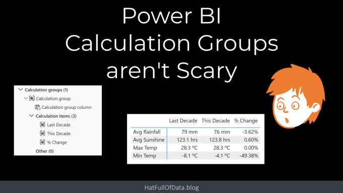](https://youtu.be/wdXWaGDiWpw)

## Scenario

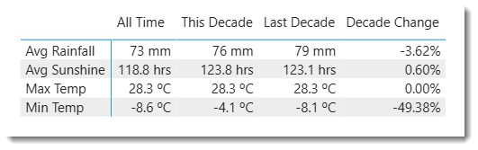

The visual requested was similar to this wating to show multiple measures with time intelligence applied. So the example I’ve used is a UK Weather report based of met office data publicly available. The row labels, e.g. Avg Rainfall, are all measures that have been formatted to match the data, e.g. 0 mm for Avg Rainfall. This could probably be done using a complex pile of measures but the technical debt that creates goes against even the minimalist best practice policies.

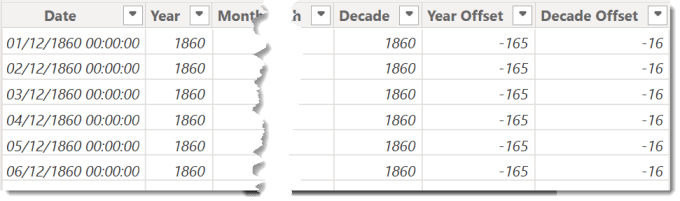

The model includes a calendar that includes a decade offset column. So if we were going to calculate the Avg Rainfall for this decade and last decade the DAX would be

```xml
This Decade Avg Rainfall = CALCULATE( [Avg Rainfall] , 'Calendar'[Decade Offset] = 0 )

Last Decade Avg Rainfall = CALCULATE( [Avg Rainfall] , 'Calendar'[Decade Offset] = -1 )
```

## Create a Calculation Group

With measures created and the calendar table prepared we are now ready to create the calculation group. In the report go to the Model View. Now on the Home ribbon there will be Calculation group button. Click this to start the process, the first step will probably be a warning that this will turn on the “Discourage Implicit measures” option for this model. If you are following best practices this should not be an issue.

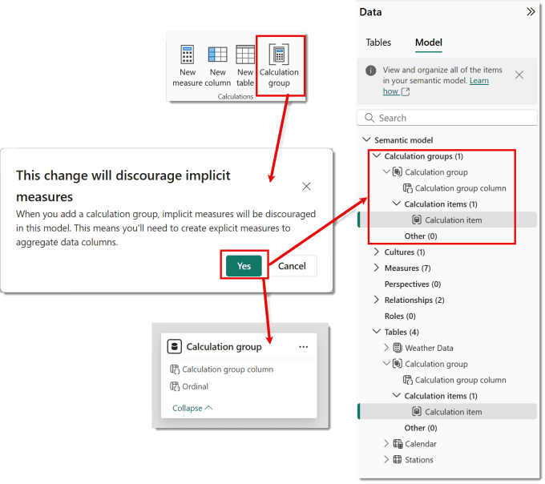

Then on the model diagram and in the model pane on the right hand side you will see a Calculation Group has been added, with one Calculation item. Double clicking on the name of the Calculation group in the model pane will allow you to rename the calculation group, e.g, Time Intelligence. This would be good practice.

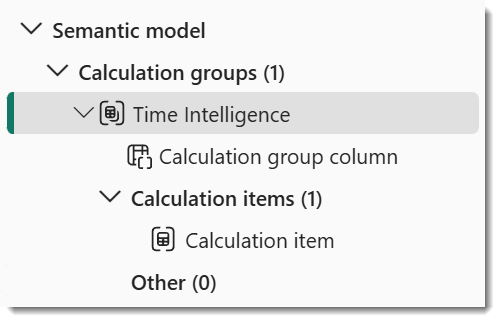

## Add Calculation Items

Calculation items are the different calculations you want to include in the group. For this example I want This Decade, Last Decade and % Change. Right click on the calculation group and from the menu select New calculation item. Then a formula appears similar to when you create a column or measure. Once you add in your formula and press enter it will appear under Calculation items.

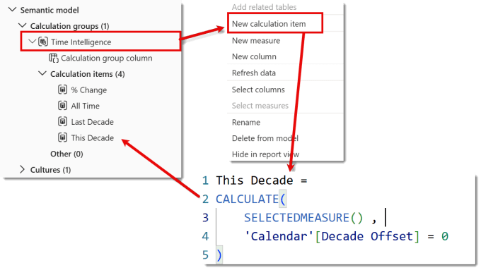

I renamed the original calculation item to All Time by double clicking on it.

```xml
This Decade = 
CALCULATE( 
    SELECTEDMEASURE() , 
    'Calendar'[Decade Offset] = 0 
)
```

## Add Calculation Group to a Matrix

Now we have created a calculation group we can start to create the matrix. Add a matrix to the report and add the measures. The measure names will appear as column headings. You can switch these to row headings in the visual formatting by looking under Values and then Options and turning on Switch values to rows.

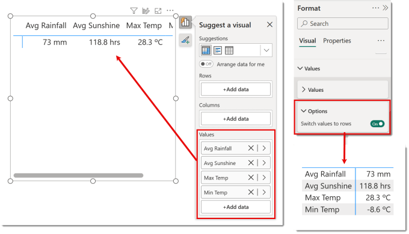

After you have added the measures and switched the values to rows you can add the calculation group to the Columns area in the visual. All the calculation items appear as columns.

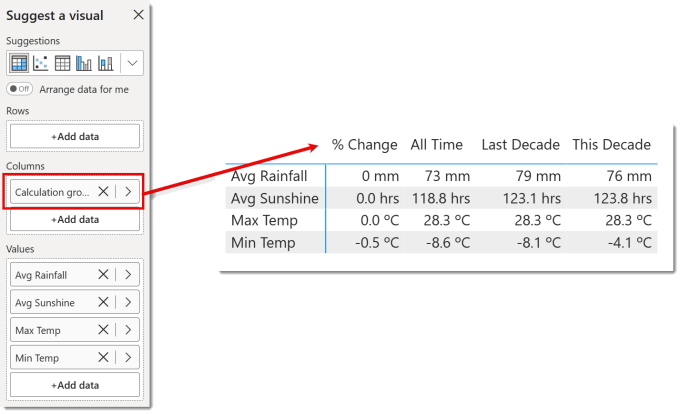

## Formatting the calculations items

The numbers shown in the previous diagram are formatted the same as the measure formatting, e.g. Max Temp is 0.0 ºC format. This is correct for all the measures except the % Change, which should be formatted 0.00%.

Select the calculation item that needs different formatting. In the properties panel turn on Dynamic format string. Then in the Format string box enter in the format as a string, e.g. “0.00%”. You can edit in the formula bar which is slightly easier.

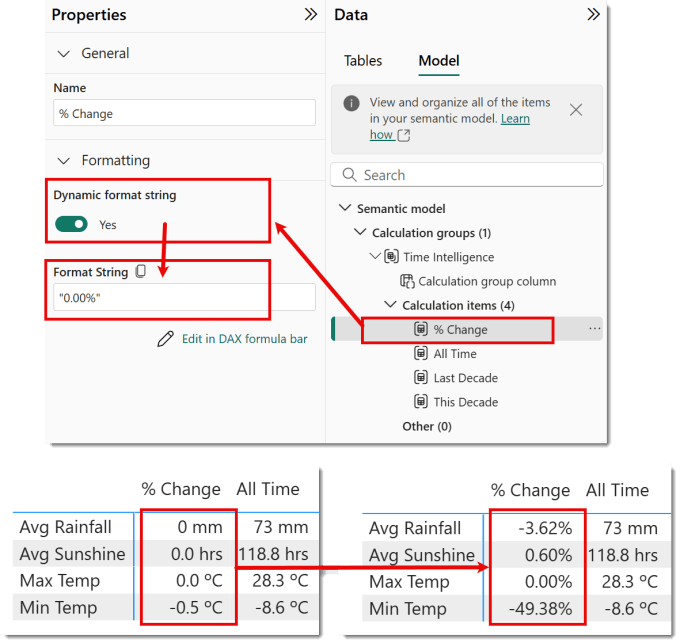

## Sorting and Selecting Columns

The Calculation items are sorted alphabetically by default. If you change the order of one calculation item it will fix the order of all the items. So I move the % Change to the end

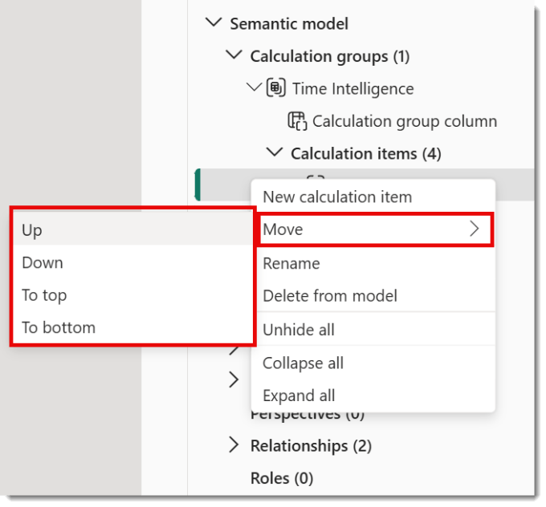

Also by default all columns are shown. The columns can be selected using the filters panel. In the filters panel, expand Calculation group column to show all the calculation item names. Un-select the columns you don’t want.

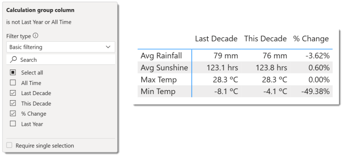

## Resources

As with anything DAX related my first port of call is SQLBI and of course Microsoft and recent announcements.

- [SQLBI – Introducing Calculation Groups](https://www.sqlbi.com/articles/introducing-calculation-groups/)

- [Microsoft – Create Calculation Groups](https://learn.microsoft.com/en-us/power-bi/transform-model/calculation-groups?wt.mc_id=DX-MVP-5003563)

- PBIX file used in this post

## Conclusion on Calculation Groups

Calculation groups are a very powerful addition to creating Power BI models that are not bloated with 100s of measures. I really hope they will be expanded to allow for dynamic names and some tricks to do conditional formatting.

