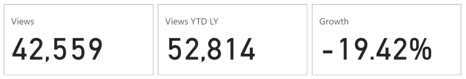
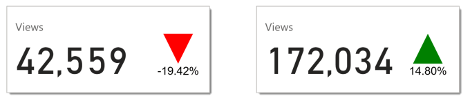
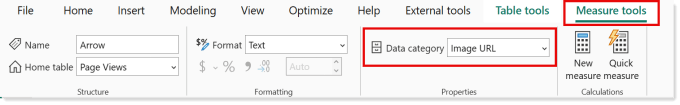
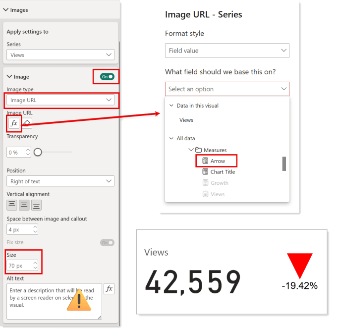
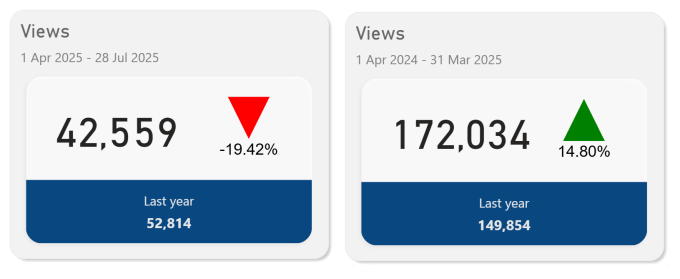

The not so new card in Power BI, introduced in 2023, includes some lovely features. The first is the simplest of adding multiple values and having cards laid out evenly in a row in a single visual. The second awesome feature adding an image to a card with SVG.

## Starting Point



This report is visualising web site views per year. In the report there are three measures, Views, Views YTD LY and Growth. In the picture above we can see views have gone down by 19% but its not very visual and takes up three cards. This post is to walk through changing that first card to show an arrow indication growth direction and the %. Something similar to the cards shown below for 2 different time periods. I am no graphic designer but these cards tell the story more effectively in my opinion. See the bottom of the post for the even prettier version.



## Create the SVG Measure

Before we can create a card with SVG we need to write the measure that contains the SVG. So here is where we cheat and refer to post I wrote years ago, called [SVG in Power BI Part 2 – KPI Shapes](https://hatfullofdata.blog/svg-in-power-bi-part-2-kpi-shapes/). This uses a measure called Growth and draws either a Green arrow pointing up or a red arrow pointing down. The final code from this blog is

Copy CodeCopiedUse a different Browser
```xml
Arrow = 
// Variables to store arrow paths
var uparrow = ""
var downarrow = ""

// Select arrow to use
var arrow = IF([Growth]>=0,uparrow,downarrow)

// Insert arrow into SVG
var svg ="data:image/svg+xml;utf8," &
         ""
            & arrow & 
         ""

RETURN svg
```

That would create the arrow using the Growth measure, I also want to add text below the arrow. So we increase the viewBox to be 130 tall so line 11 becomes

Copy CodeCopiedUse a different Browser
```xml
""
```

To add in the text I make use of another previously written post [SVG in Power BI – Part 4 – Adding SVG Text](https://hatfullofdata.blog/svg-in-power-bi-adding-svg-text/). I create a text tag that is middle anchored to 50,130 and shows the Growth measure formatted as a percentage.

Copy CodeCopiedUse a different Browser
```xml
var growthtext = "" 
                 & FORMAT([Growth],"0.00%") & ""
```

So the final measure looks like this

Copy CodeCopiedUse a different Browser
```xml
Arrow = 
// Variables to store arrow paths
var uparrow = ""
var downarrow = ""

// Select arrow to use
var arrow = IF([Growth]>=0,uparrow,downarrow)

// Add text
var growthtext = "" & FORMAT([Growth],"0.00%") & ""
// Insert arrow into SVG
var svg ="data:image/svg+xml;utf8," &
         ""
            & arrow & growthtext &
         ""

RETURN svg
```

## Measure Data Category

As with any SVG measures you need to remember to change the Data category of the measure to Image URL on the measures toolbar or in the Model view properties pane.



## Add SVG to the Card

The final part is to add the SVG measure to the card. With the card selected head to the formatting settings. Turn on the Image and then change the Image type to Image URL. The click on the fx button under Image URL to select the SVG measure we created, Arrow.



The image is there, even though you can’t see it due to it being too small. Change the size of the image to fit your card. You can change the position, alignment and spacing to fit your card. Do make sure you remember that numbers in a report will change so allow for that.

## Accessibility

I know accessibility in published Power BI reports is not great, but it is made even worse by not making use of the Alt text options. So I created a measure Arrow Alt Text that will describe the image. I then click the fx button under Accessibility and use the measure.

Copy CodeCopiedUse a different Browser
```xml
Arrow Alt Text = 
var ArrowText = IF( [Growth] >= 0 , "Green arrow shape pointing up ", "Red arrow shape pointing down " )
var Result = ArrowText & "with " &  FORMAT([Growth],"0.00%") & " below."
Return Result
```

## Even More Tricks

[](https://www.youtube.com/watch?v=aPrh4sK8CX4)

Guy in a Cube have a video that does a few more tricks to make it even prettier. Its a high speed video so expect to stop, rewind and understand all the tricks Adam uses. His shadow suggestions are great. Adding his tricks and my svg I changed the card to look like this.



## References

- [Microsoft New Card Description](https://learn.microsoft.com/en-us/power-bi/visuals/power-bi-visualization-new-card)

## Conclusion

The new cards are very clever and in the right hands will enhance reports. Adding SVG is a great addition and I know clients who love adding their own graphics. The complexity of understanding which formatting features are available depending on if you pick one series or All is frustrating but that perhaps is a separate post all together.

