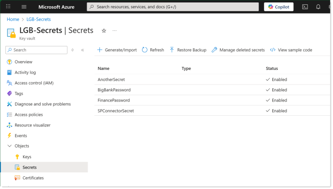
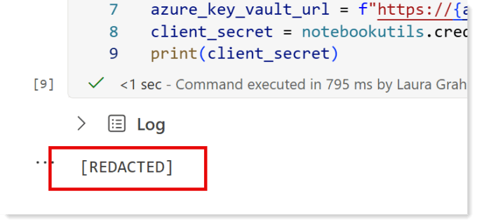

I’ve recently been working with Notebooks in Microsoft Fabric and have needed to get a credentials information that should be kept secure. The obvious place to store such credentials is Azure Key Vault so now we need to get our secret from there.

This is a really short post to help me out when I need a fast explanation on projects.

## Azure Key Vault Part

I’ve previously blogged how to setup a key vault and add a secret – [https://hatfullofdata.blog/create-azure-key-vault-to-store-id-and-secret/](https://hatfullofdata.blog/create-azure-key-vault-to-store-id-and-secret/).

For this post I have a vault called LGB-Secrets and it has a secret called SPConnectorSecret.



The vault URI is https://lgb-secrets.vault.azure.net/ which can be calculated from the vault name.

## Python to Get Secret from Azure Key Vault

Notebookutils is a built in package for Microsoft Fabric notebooks. It was previously known as MSSparkUtils. It contains plenty of really useful methods to perform tasks with files, environments and credentials. Microsoft’s documentation can be found at :

[https://learn.microsoft.com/en-us/fabric/data-engineering/notebook-utilities#credentials-utilities](https://learn.microsoft.com/en-us/fabric/data-engineering/notebook-utilities#credentials-utilities?wt.mc_id=DX-MVP-5003563)

The method notebookutils.credentials.getSecret requires 2 parameters, vault URI and secret name. This code block looks like this.

Copy CodeCopiedUse a different Browser
```xml
azure_key_vault_name = "lgb-secrets"
azure_key_vault_secret_name = "SPConnectorSecret"
azure_key_vault_url = f"https://{azure_key_vault_name}.vault.azure.net/" 
client_secret = notebookutils.credentials.getSecret(azure_key_vault_url,azure_key_vault_secret_name)
```

The account being used to run the notebook will need access to the key vault.

## Reacted!

The notebook understands that the value you fetched from the key vault should be kept secure. So if you try to print the client_secret it will not show you the result and will show REDACTED instead.



## Conclusion

I know this is a very short post, which is a good thing as that means its a simple concept. It is here because I also wanted a short post that contains the code block I want to be able to copy and use easily.

