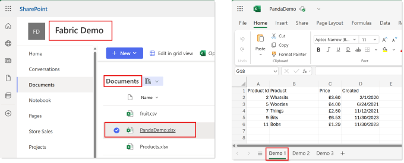
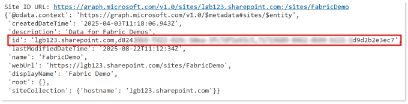
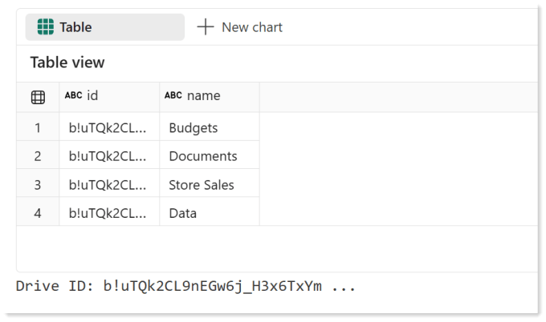
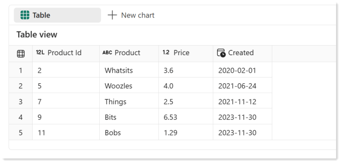

A recent project made me reach out to Lewis Baybutt to scream “Help!, I need help getting with authentication for an Excel file in SharePoint in a Microsoft Fabric Notebook”. Yes all the delights of Excel and SharePoint in one project.  So started the battle with understanding authentication, permissions and apparently a Notebook and Microsoft Graph is the way.

The reason for the project was the original solution was using Gen2 Dataflows and we ran out of capacity. Datameerkat has done a nice summary of comparing Dataflow to Copy Activity to a Notebook, [https://datameerkat.com/copy-activity-dataflows-gen2-and-notebooks-vs-sharepoint-lists](https://datameerkat.com/copy-activity-dataflows-gen2-and-notebooks-vs-sharepoint-lists). Its for lists but the same logic works for files in SharePoint. So for this project we selected the Notebook route.

## Final Goal of Notebook and Microsoft Graph

On a SharePoint site there is an Excel file that contains some data I want to load into a table in a Microsoft Fabric Lakehouse. The Pandas library includes a method called read_excel that can pull the data into a dataframe if it has the file content. And we know how to write a dataframe into table, so the real goal is to get the file content of a file on a SharePoint site.



We save the details of file name etc into variables to use later.

Copy CodeCopiedUse a different Browser
```xml
sharepoint_domain = "YOURDOMAIN.sharepoint.com"
site_name = "FabricDemo"
library_name = "Documents"
file_name = "PandaDemo.xlsx"
sheet_name = "Demo 1"
```

## Service Principal, Permissions Etc

The first part of this series is definitely not my skill set, it involved Power Shell! So we agreed he would write the first part and I would write part 2. So Lewis has covered that topic in Part 1 which can be found here [https://www.lewisdoes.dev/blog/lewis-and-laura-vs-fabric-notebooks-and-microsoft-graph-part-1/](https://www.lewisdoes.dev/blog/lewis-and-laura-vs-fabric-notebooks-and-microsoft-graph-part-1/)

The credentials created in the post should be stored in Azure Key Vault. I wrote a blog post how to do that and another one how to retrieve it into notebook

- [https://hatfullofdata.blog/create-azure-key-vault-to-store-id-and-secret/](https://hatfullofdata.blog/create-azure-key-vault-to-store-id-and-secret/)

- [https://hatfullofdata.blog/get-secret-from-azure-key-vault/](https://hatfullofdata.blog/get-secret-from-azure-key-vault/)

I created a code block to create three variables, tenant_id, client_id and client_secret. Swap in your TENANT ID etc to make it work for you. The notebookutils library is always loaded in a Microsoft Fabric Notebook.

Copy CodeCopiedUse a different Browser
```xml
# Authentication details
tenant_id = "TENANT ID"
client_id = "CLIENT ID"
# Get secret from Key Vault
azure_key_vault_name = "VAULT NAME"
azure_key_vault_secret_name = "SECRET NAME"
azure_key_vault_url = f"https://{azure_key_vault_name}.vault.azure.net/" 
client_secret = notebookutils.credentials.getSecret(azure_key_vault_url,azure_key_vault_secret_name)
```

## Requests Library

This whole post is lots of HTTP get requests made way easier using the Requests library. Documentation for this library can is here [Requests: HTTP for Humans™ — Requests 2.32.5 documentation](https://docs.python-requests.org/en/latest/index.html)

We use two patterns very similar, obviously there is a import requests statement in a previous code block.

Copy CodeCopiedUse a different Browser
```xml
reponse = requests.post(url , data=token_data)
# Raise error if request fails
response.raise_for_status()
```

Copy CodeCopiedUse a different Browser
```xml
reponse = requests.get(url , headers=headers)
# Raise error if request fails
response.raise_for_status()
```

## Get Access Token

Before we can use Notebook and Microsoft Graph together we need an access token. For all the requests.get we need headers which includes an access token. So the next task is to get that access token which uses the first pattern from above. If you’ve used the tenant_id, client_id and client_secret variables you can just copy and paste this code into a block

Copy CodeCopiedUse a different Browser
```xml
token_url = f"https://login.microsoftonline.com/{tenant_id}/oauth2/v2.0/token"
token_data = {
    "grant_type": "client_credentials",
    "client_id": client_id,
    "client_secret": client_secret,
    "scope": "https://graph.microsoft.com/.default"
}
response = requests.post(token_url, data=token_data)
response.raise_for_status()  # Raise error if request fails
access_token = response.json().get("access_token")

# Print the result
print(" Access Token Received:", access_token[:50], "...")

headers = {"Authorization": f"Bearer {access_token}"}
```

The last step is to put the access token into a JSON object called headers which will be used for the next stages.

## Getting the Site ID and Drive ID

We need the url to download the file content. The request to get that url is

https://graph.microsoft.com/v1.0/sites/{site_id}/drives/{drive_id}/root:/{file_name}:/content

So we need the site_id and the drive_id. Btw drives are document libraries… yeah naming confusion, don’t blame me! We already have the file_name, if its in a folder the name needs to include that.

### Site ID

Using https://graph.microsoft.com/v1.0/sites/{sharepoint_domain}:/sites/{site_name} with the headers we built earlier in a requests.get we get a json response that includes an id value

Copy CodeCopiedUse a different Browser
```xml
site_id_url = f"https://graph.microsoft.com/v1.0/sites/{sharepoint_domain}:/sites/{site_name}"
print("Site ID URL:",site_id_url)
response = requests.get(site_id_url, headers=headers)
response.raise_for_status()  # Raise error if request fails
display(response.json())
```

Produces



So we then use the following code to get the site_id and print it for debugging.

Copy CodeCopiedUse a different Browser
```xml
site_id=response.json()['id']
print("Site ID:",site_id[:50], "...")
```

### Drive ID

Using https://graph.microsoft.com/v1.0/sites/{site_id}/drives?$select=name,id will give us a list of the document libraries on the site. A site can have more than one library so we need to handle multiple rows being returned. My choice was to save it into dataframe and then filter that to get the result.

Copy CodeCopiedUse a different Browser
```xml
drive_id_url = f"https://graph.microsoft.com/v1.0/sites/{site_id}/drives?$select=name,id"
response = requests.get(drive_id_url, headers=headers)
response.raise_for_status()  # Raise error if request fails

# Convert response json into a dataframe
df_drives = spark.createDataFrame(response.json()['value'])
display(df_drives)

# Filter the dataframe to the specified library and get the id
drive_id = df_drives.filter(col("name")== library_name).collect()[0]["id"]
print("Drive ID:",drive_id[:25], "...")
```

That gives this output



So now we have the site id and the drive id so now we can get the file content using our Notebook and Microsoft Graph.

## Get the File Content

This uses the same pattern as the previous 2 requests, the difference is the path includes /content on the end to indicate we want the content. There is very little we can print out to debug the response as the file contant is binary

Copy CodeCopiedUse a different Browser
```xml
# Retrieve the File Content from SharePoint using Graph API
file_url = f"https://graph.microsoft.com/v1.0/sites/{site_id}/drives/{drive_id}/root:/{file_name}:/content"
print("File URL:",file_url[:75], "...")
response = requests.get(file_url, headers=headers)
response.raise_for_status()  # Raise error if request fails
```

## Pandas and File Content

Pandas read_excel method wants a file type to work with. Using BytesIO from io library we can create that.  Documentation for BytesIO can be found here [https://docs.python.org/3/library/io.html](https://docs.python.org/3/library/io.html). We can then use read_excel from Pandas library to fetch the data from the sheet. I’ve kept it simple, the tricks on handling more complex data in Excel is for another post.

Copy CodeCopiedUse a different Browser
```xml
# Import methods
from io import BytesIO
from pandas import read_excel

# Convert response
xls = BytesIO(response.content)

# Get data from sheet
df = read_excel(xls, sheet_name=sheet_name) 
display(df)
```

From the above code we get the following in a panda dataframe ready to save into a table.



## Final Notebook

The complete notebook that could be imported into a Fabric Workspace can be found here [https://github.com/HatFullOfData/CodeStuff/blob/main/Sample%20Files/Access%20SharePoint%20using%20Microsoft%20Graph.ipynb](https://github.com/HatFullOfData/CodeStuff/blob/main/Sample%20Files/Access%20SharePoint%20using%20Microsoft%20Graph.ipynb)

## Conclusion

Congratulations on getting this far with Notebook and Microsoft Graph. The above looks like hard work when connecting from a Gen2 Dataflow is so much easier. But the saving on capacity usage and the flexibility of a notebook I think gives us more options in the future.

