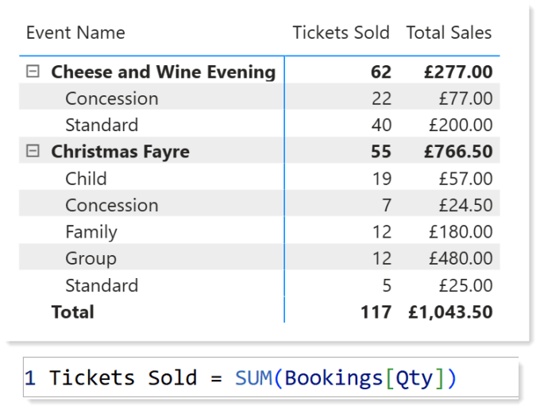
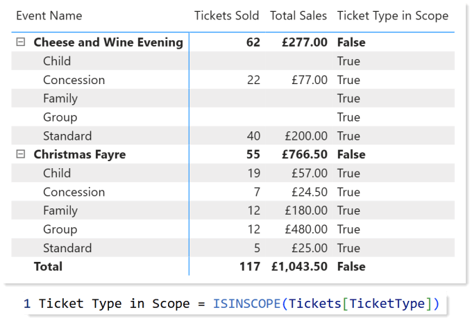
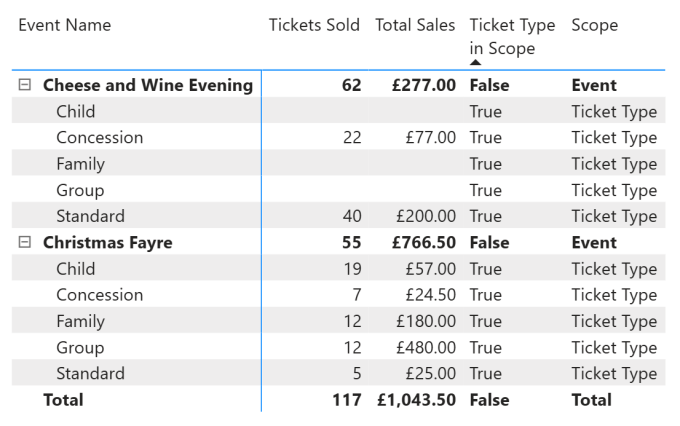
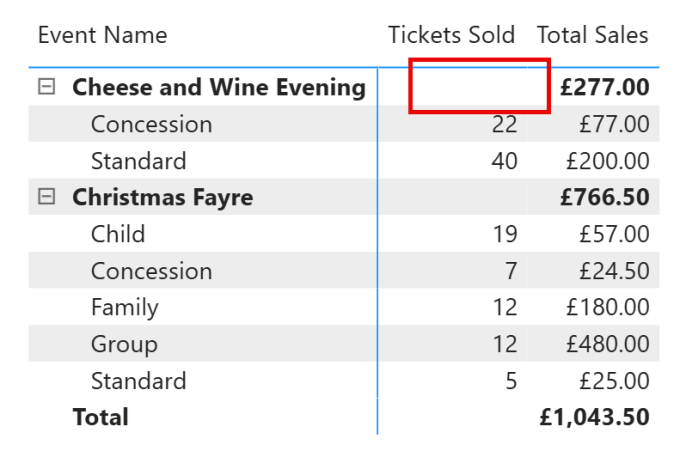
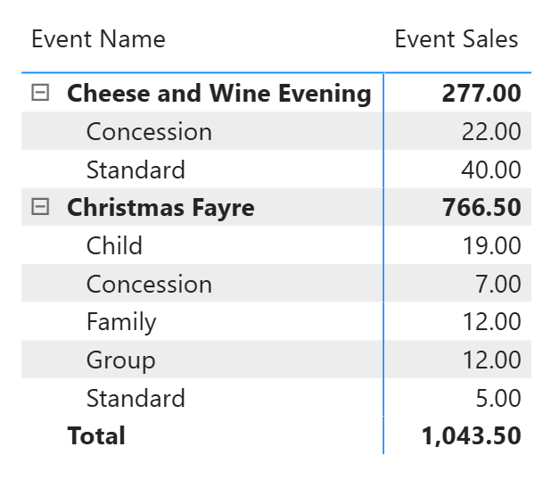
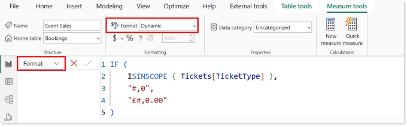
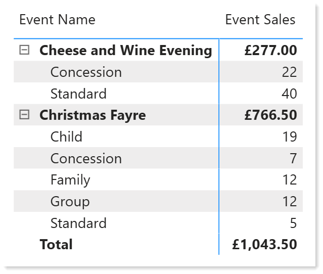

I recently had a request for totals in a Matrix to be shown for some columns and not for other columns. My solution was to use ISINSCOPE in a Matrix to work out which level of the matrix to choose what to return.

## Scenario

At an event you sell tickets. So for the Cheese and Wine evening we can see 62 tickets are sold so we expect 62 people. BUT some tickets are for multiple people such as Family Ticket is 2 adults and 3 children so the 55 tickets sold for the Christmas Fayre means very little as a Family ticket is 5 people and a Group ticket is 10. So total tickets for more than one ticket type does not make sense and is misleading.



So I’d like the Tickets Sold measure to not show a value on rows combining the ticket types, ie the total rows on this matrix.

## Determining the Ticket Type Rows

The first step is to determine which rows are the ticket type rows and which rows aren’t. For this we can use the DAX function ISINSCOPE.



For demo purposes I created a measure that returns a true or false using the function ISINSCOPE. We can see it returns true on the ticket type lines but not the event or total lines. If we want to show all the layers we could look at all the fields in the matrix in a measure. Make sure you start with the lowest level first, so in my case Ticket Type.



Copy CodeCopiedUse a different Browser
```xml
Scope =
SWITCH (
    TRUE (),
    ISINSCOPE ( Tickets[TicketType] ), "Ticket Type",
    ISINSCOPE ( Event[Event Name] ), "Event",
    "Total"
)
```

As you can see, using the above measure we can tell which level of the matrix a value is on. So we only need to return total tickets if the ticket type is in scope and we can return nothing on other levels.

## Final Measure

We can use a simple if statement based on the ISINSCOPE for Ticket Type. That works really well and the customer were partly happy.

Copy CodeCopiedUse a different Browser
```xml
Tickets Sold =
IF (
    ISINSCOPE ( Tickets[TicketType] ),
    SUM ( Bookings[Qty] )
)
```



## Next Request

Once we showed that could be done they wanted to combine the 2 columns of numbers. The request was to not have a separate Total Sales column but to show the Total Sales value as in the total row for each event and the grand total at the bottom. For this we wrote a new measure called Event Sales.

Copy CodeCopiedUse a different Browser
```xml
Event Sales =
IF (
    ISINSCOPE ( Tickets[TicketType] ),
    SUM ( Bookings[Qty] ),
    SUMX ( Bookings, Bookings[Qty] * RELATED ( Tickets[Price] ) )
)
```



We can see in the matrix above the money value appears in the total rows and the number of tickets in the ticket type rows. But they are all formatted the same so it is not clear what the numbers mean.

## Adding Dynamic Formatting

This is not going to be a full description of dynamic formatting, that needs its own post. For the Event sales measure we select Dynamic formatting. In the formula we use the same pattern as the measure for the two different formats.





## Resources

- Microsoft Learn ISINSCOPE – [https://learn.microsoft.com/en-us/dax/isinscope-function-dax](https://learn.microsoft.com/en-us/dax/isinscope-function-dax?wt.mc_id=DX-MVP-5003563)

- DAX Guide ISINSCOPE – [https://dax.guide/isinscope/](https://dax.guide/isinscope/)

- Hat Full of Data Dynamic Formatting – Its coming!

- Microsoft Learn Dynamic Formatting – [https://learn.microsoft.com/en-us/power-bi/create-reports/desktop-dynamic-format-strings](https://learn.microsoft.com/en-us/power-bi/create-reports/desktop-dynamic-format-strings?wt.mc_id=DX-MVP-5003563)

- SQLBI – [https://www.sqlbi.com/articles/introducing-dynamic-format-strings-for-dax-measures/](https://www.sqlbi.com/articles/introducing-dynamic-format-strings-for-dax-measures/)

## Conclusion

Adding ISINSCOPE into your repertoire of functions opens up lots of possibilities. For the start of this post it removed a confusing total, in the development of that Matrix it added an extra dimension to a measure.  Be careful to not make it too confusing, I know some will dislike the one column having two values in it.

