Direct Lake is the best way to build a semantic model on data in a Lakehouse or a Warehouse. We can then use Power BI to build reports and possibly even a make a Workspace App to deliver those reports to the business. So what permissions do the business users need to view those reports? This post will explore using Direct Lake and User Permissions to make sure everyone can see data in the reports.

## IMPORTANT

This is the simplest method of fixing permissions so someone can view a report using direct lake. If your lakehouse or warehouse contains data they should not have access to this is not the method to use.

## Scenario

For this post I have built the following :

- Workspace that has a workspace app built and up to date.

- Lakehouse_Report connected to a semantic model, Lakehouse_Model, that has a direct lake connection to a lakehouse, Permissions_Demo_Lakehouse

- Warehouse_Report connected to a semantic model, Warehouse_Model, that has a direct lake connection to a lakehouse, Permissions_Demo_Warehouse

- Both the Warehouse and Lakehouse contain one table, Projects with 10 rows of data. Both reports show this in a chart.

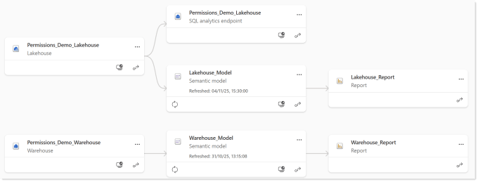

I have given one user, Dan, Vistor access to the workspace and I’ve given the Project team security group access to the workspace app.

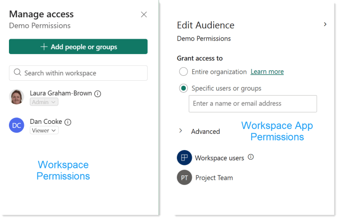

Both reports work fine for me as the workspace owner. The report is direct lake and user permissions are admin.

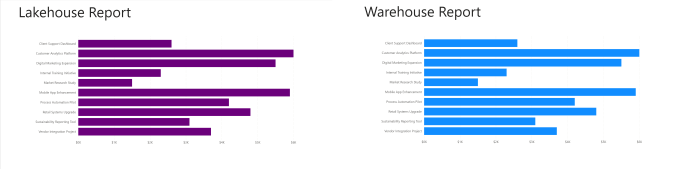

## Viewing Reports as Dan

Viewing the report as Dan is an example of a report that is direct lake and user permission is viewer. Dan can see the warehouse data but he cannot see the lakehouse data.

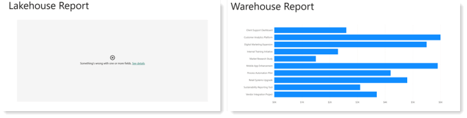

## Viewing Workspace App as Sam

Viewing the report as Sam, who is a member of the Project team security is an example of a reports that are direct lake and user permission is app only. Sam cannot see either the lakehouse or the warehouse report charts.

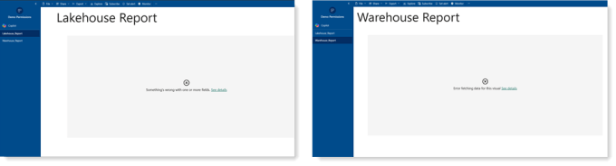

## Permissions

Whenever data is not coming through for some but not others it is usually an issue with permissions somewhere. Everyone can see the report, they get the headings. The connection is direct lake into the semantic model we need to look at user permissions where the data lives, the lakehouse and the warehouse.

Each item in the workspace has permissions. By default permissions are inherited from the workspace. There are two fixes to do. The first is Dan’s access to the lakehouse and the second is project team access to both lakehouse and the warehouse.

## Fix Dan’s Lakehouse Access

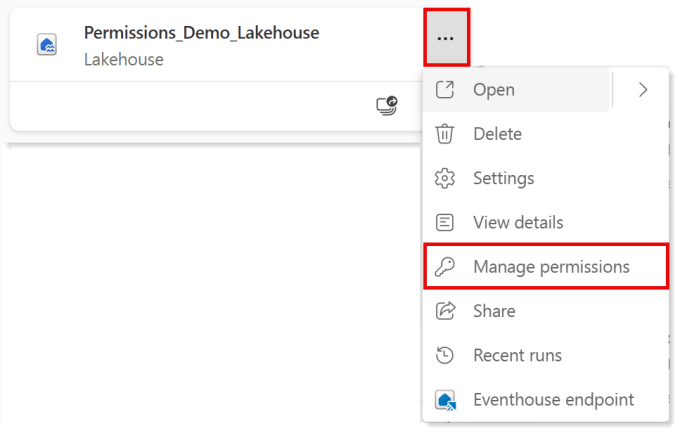

In the workspace, click on the three dots on the lakehouse. Then from the menu select Manage permissions. This shows a list of the people with access and the Role which gave them that access. We can see Dan has Read and ViewOutput

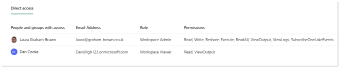

Read only gives the user permission to connect to the lakehouse, it does not let them see the data. Neither does ViewOutput. I’d love to find documentation as to what ViewOutput allows but I’ve not found it yet. I will update this post when I do.

Click on the three dots at the end of permissions and select Add ReadAll. Now when Dan looks at the reports the Lakehouse one will work. Sometimes it takes 10-15 minutes for the permissions to work..

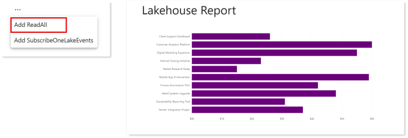

## Fix Sam’s Access via the Workspace App

Sam gains access to the workspace app through being a member of the Project Team security group. The security group is not mentioned in the permissions of the lakehouse or warehouse. If you go look it is listed in the permissions of the semantic model as App.

In the lakehouse permissions, click on +Add user. In the Grant people access dialog add the user group or people into the box. Decide if you are emailing them and add a message, I’m not emailing anyone an auto generated email! I have not ticked any of the additional permissions. Then click Grant.

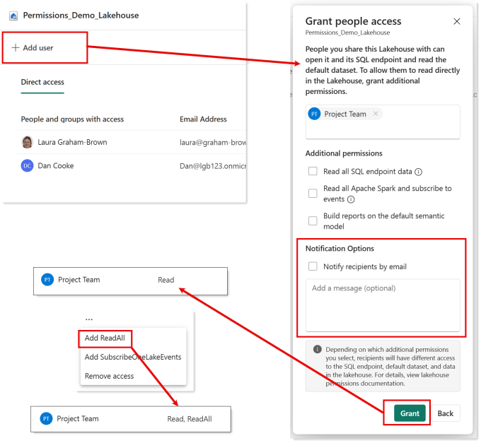

This will give them Read access. Then as we did for Dan, click on the three dots and click Add ReadAll and this.

Warehouse permissions are slightly different. Dan has Read and ReadData permissions which gives enough access for him to view the report. So we can use the same process as on the lakehouse and duplicate those permissions. Note that in the Grant people access dialog no additional permissions were ticked.

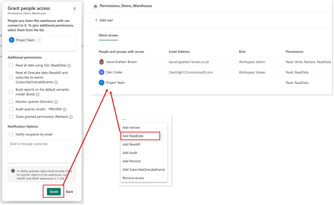

And after a few minutes when Sam refreshes the Workspace App they can see the reports both working.

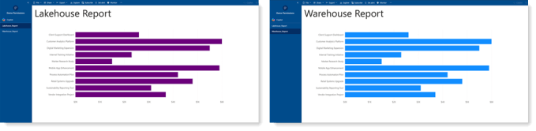

## Note!

The permissions given do mean that if Sam now has access to run SQL against the Warehouse but not the Lakehouse which is behind the semantic model so any row level security in the model will not apply. They do allow Sam to explore the data in both the semantic models.

## Resources

The reason I wrote this blog post was I couldn’t find a resource to show the simple fix of manage permissions. [Lakehouse sharing and permission management – Microsoft Fabric | Microsoft Learn](https://learn.microsoft.com/en-us/fabric/data-engineering/lakehouse-sharing) is the closest I got.

## Conclusion

Giving someone access to the whole lakehouse or warehouse could be dangerous. This post gives the simplest of fixes assuming the report viewer is allowed to see all the data with a report that is direct lake and user permissions are read only in the workspace or app only.

With new security features now available we can make the permissions fix more complex requirements. Handling Direct and User permissions needs careful consideration and should be discussed as part of your data governance.

## Other Posts that might Interest

## Microsoft Fabric Quick Guides

- [Create a Lakehouse](https://hatfullofdata.blog/fabric-create-a-lakehouse/)

- [Load CSV file and folder](https://hatfullofdata.blog/fabric-upload-a-file-and-folder/)

- [Create a table from a CSV file](https://hatfullofdata.blog/fabric-create-table-from-csv-file/)

- [Create a Table with a Dataflow](https://hatfullofdata.blog/microsoft-fabric-create-tables-with-dataflows/)

- [Create a Table using a Notebook and Data Wrangler](https://hatfullofdata.blog/microsoft-fabric-notebook-and-data-wrangler/)

- Exploring the SQL End Point

- Create a Power BI Report

- Create a Paginated Report

