Dataverse is the data store behind parts of Dynamics and lots of Power Platform projects. So Dataverse can contain vital business data that will be needed for reporting. In this post we are going to look at one method which is using copy job with Dataverse to copy across data in Microsoft Fabric.

## Table of Contents

- [Scenario](#scenario)
- [First Copy Job – Dataverse Connector](#first-copy-job-dataverse-connector)
- [Copy Job Run](#copy-job-run)
- [Copy Job using SQL Server connection](#copy-job-using-sql-server-connection)
- [Incremental and Merge Running](#i)
- [Trouble Shooting](#trouble-shooting)
- [Alternative Options to using Copy Job with Dataverse](#alternative-options-to-using-copy-job-with-dataverse)
- [Conclusion](#conclusion)

## Scenario

For this post we will look at 2 tables, Accounts and Contacts so all the code will be common to any Dataverse environment. I have 5 Account records and 10 Contact records. I also have the environment path org29d4c6d3.crm11.dynamics.com.

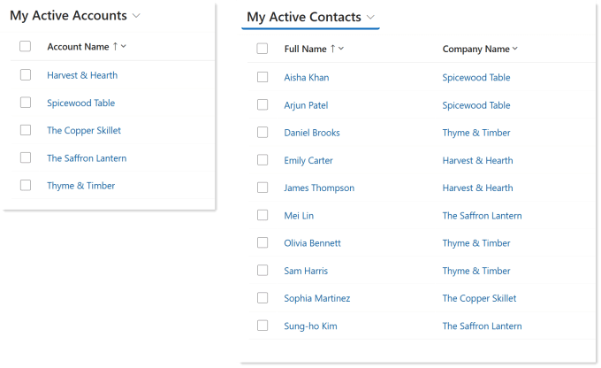

In Microsoft Fabric I have a workspace, Finance Reporting, with a Lakehouse, Finance_Lakehouse.

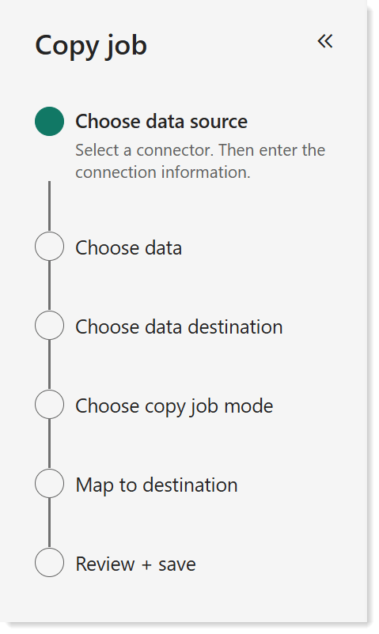

## First Copy Job – Dataverse Connector

Copy Job is a great artifact to move data easily into Fabric. Simplest version just copies data, we can then add incremental and merging. More details can be found here [https://learn.microsoft.com/en-us/fabric/data-factory/what-is-copy-job](https://learn.microsoft.com/en-us/fabric/data-factory/what-is-copy-job?wt.mc_id=DX-MVP-5003563)

For the first example we will copy from Dataverse using the Dataverse connector. The wizard that walks you through creating a Copy Job has 6 steps. For this first one we will walk through each step.

### Create Copy Job

Either using a task flow Get Data’s add item or using Add item in the workspace, select Copy job. Type in a name and click Create.

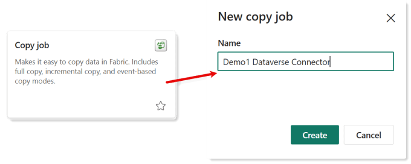

### Choose Data Source

Next step is connecting to Dataverse. For this example we are using the Dataverse connector. Click on the Dataverse option under New sources. When the next screen appears enter in the Environment domain. If it is your first time connecting there you will be given the option to name your connection and select a privacy level. It will guess the authentication and login – this is not the blog to discuss options here.

Once these are done click Next

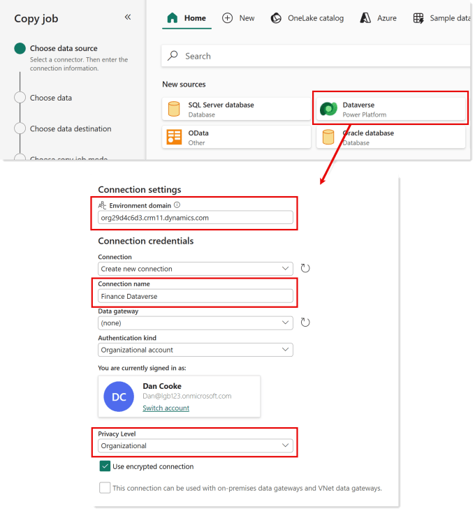

### Choose Data

Choosing the data is very simple, the next screen lists the tables from dataverse using their display names and logical names in brackets. Yes they call them Entities…. No comment.  If you expand a table the logical names of fields are listed. There is a search box that will allow you to search for a table using either of the names. If you have selected a table the search will expand to the field names as well. Interestingly for choice columns you only get the code column, not the name column. That is going to be another post!

If you select a table all the columns will be imported. You select the required columns manually by selecting individual columns, its a touch manual and requires searching and scrolling lots in my experience. Next version is better in my opinion – feel free to scroll down!

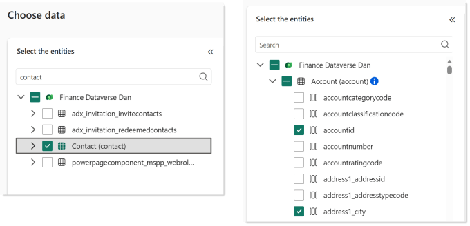

When you’ve selected your tables and columns click Next.

### Choose Data Destination

Data destination is another easy step. Select your lakehouse from the OneLake catalog.

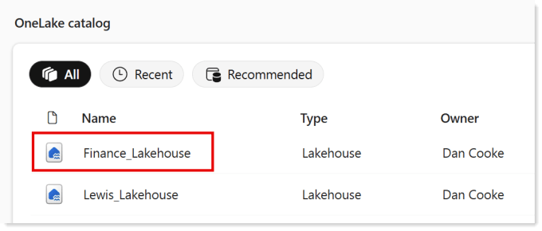

### Choose copy job mode

With the dataverse connector you only get one option, Full copy. In the Map to destination you get to choose if that is an append or overwrite.

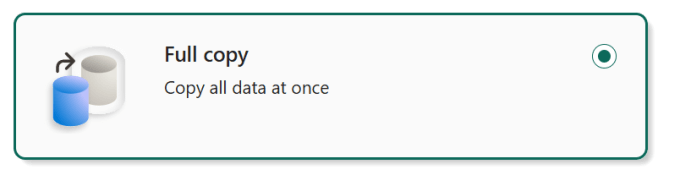

### Map to destination

The next screen shows update method and the tables being imported. Clicking on Edit update method will give you the option of Append or Overwrite. Append is the default but this will just duplicate you data every time you run this copy job. I have changed it to Overwrite. Merge is not available in this version.

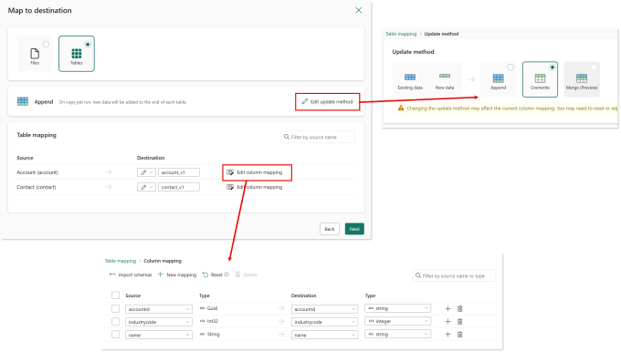

You can enter names for your destination tables and click Edit column mappings to tweak column names or remove some mapping. The columns selected will match the columns you selected back in Choose data.

Click Next once you are happy.

### Review + save

The final screen will give you an overview of what the copy job is going to do. You can select if you want it to run now, run once or scheduled. I’m choosing to let it run so I’ll just click Save + run

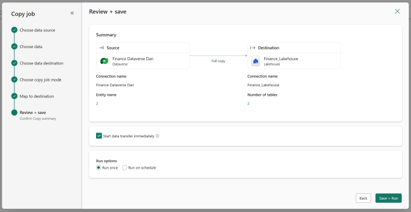

## Copy Job Run

When a copy job runs such as after saving in the previous steps you can see the execution happening. Each table is listed and when it succeeds you will see how many rows were read and how many were written. In our example read and written are the same.

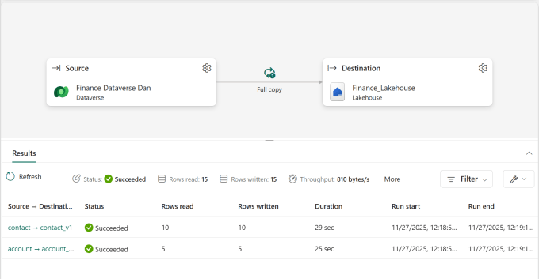

Once the run has completed we can go check the Lakehouse and we can see tables. It might need a refresh to show.

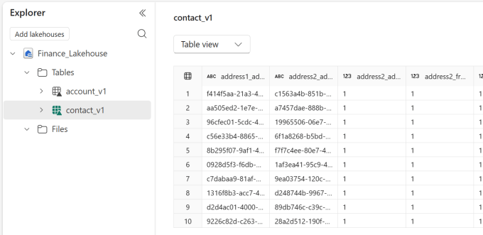

## Copy Job using SQL Server connection

Although the dataverse connector works, the selection of columns is very manual. You also get no option for incremental updates or using merge. So the next example will use SQL Server connector. In a previous post [https://hatfullofdata.blog/using-sql-on-dataverse-for-power-bi/](https://hatfullofdata.blog/using-sql-on-dataverse-for-power-bi/) I show how you can use SQL on Dataverse with some great hints from Scott Sewell.

From that post and with the addition of the modifiedon field here is the SQL for the accounts table. We will use this later.

Copy CodeCopiedUse a different Browser
```xml
Select
	accountid as AccountID,
	name as Account,
	industrycodename as Industry,
    modifiedon,
	statecode,
	statecodename
from
	dbo.account
```

### New Copy Job using SQL Server

Create a copy job as before giving it a name. For the connector select SQL Server. The Server is the environment path as used before, e.g. org29d4c6d3.crm11.dynamics.com. Remember to edit the connection name and privacy level. There is no point adding a Database, it makes no difference. After you press next you need to wait for the database list to load and then select the only database offered.

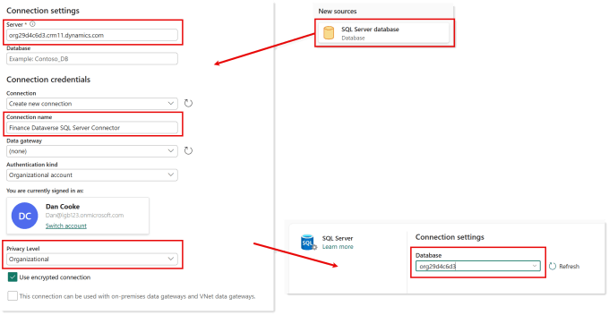

### Choose Data

The next screen for choosing the data starts by showing you an error. Ignore that, it means you can’t use the interface to select your tables and columns but you can add queries. Expand Queries in the bottom left and click on New query. Type in a name, eg Accounts and then in the query box on the right put in your query. You can check it returns the right data by clicking on preview data.

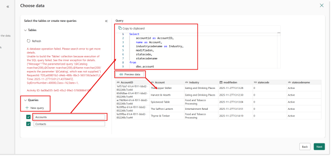

Repeat the above for each of your tables and then click Next.

### Incremental and Merge setup

When you choose your lakehouse in the data destination and move onto the copy job mode screen you now get 2 options, Full copy and Incremental copy. The incremental copy will initially copy everything and then in the future will only copy across changes. In order to recognise which records have changed you need a data time column of when it last changed. Hence we have included the modifiedon column.

So incremental is only going to process updated or new rows, but what do you want done with those new rows? Append will add the newly updated rows giving you the complete history of each row. Overwrite you will loose rows that have not been modified. Merge is currently in preview but would allow you to update the row that matches on a unique field, e.g. Account Id.

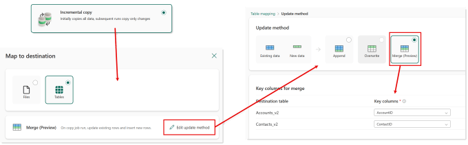

Click Incremental and then Next. In the Map to destination screen, click on Edit update method and select Merge and then select the unique id column for each table. When you click next you will be prompted to select the incremental date time column for each table. Click next to the final stage.

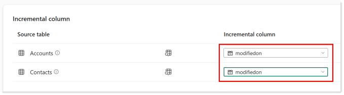

### Save, Review and Schedule

On the final screen not only do you get to save and review but you also get to schedule due to us picking incremental. You can pick repeat by the minute or hourly and pick dates etc. Be aware incremental requires more compute so will consume compute faster than a straight copy but on huge tables the reduced copy will be worth it.

Select your options and Save and Run

## Incremental and Merge Running

The first time we run just as before the rows read and written include all the data. If we go and edit one row in the accounts table and re-run the copy job, only one row is read and written for the accounts table and nothing for the contacts table.


## Trouble Shooting

In preparation for this post I’ve hit a number of issues.

- Although there is a back button in the wizard, going back to the data source and tweaking the queries just breaks the copy job.

- You name a column in the SQL with a space, that update will fail with a weird error. No spaces in column names!

## Alternative Options to using Copy Job with Dataverse

### Link to Microsoft Fabric

Using the Link to Microsoft Fabric in Dataverse sounds like a great option. You will be able to add shortcuts in a Lakehouse to the data and it will all be awesome.

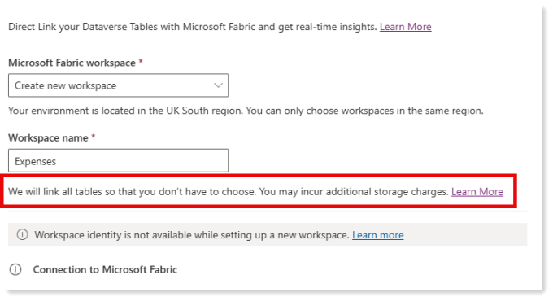

Just after you select the workspace that the data will go to there are 2 short sentences that you should read carefully.

“We will link all tables so that you don’t have to choose. You may incur additional charges.”

I’ll not comment on the “so you don’t have to choose” as I’m not sure I have anything polite to say. That additional storage is in Dataverse which could cost $40 per 1GB per month and with all the tables that could easily become a huge expense, even empty tables take up space. All this so we can have a shortcut in Fabric.

Platform Guardian blog has a great post to walk you through doing this[https://platformguardian.blog/2023/11/05/creating-the-dataverse-connector-in-fabric/](https://platformguardian.blog/2023/11/05/creating-the-dataverse-connector-in-fabric/)

## Conclusion

Copy Job is one of my favourite Fabric artifacts because they are simple to set up. Editing them is foul so I end up re-building them. Its a brilliant low-code solution to copying across data from dataverse and into a lakehouse. Be aware incremental is going to eat capacity so don’t bother with small tables just do a full copy over writing every time.

I don’t see any benefit using the dataverse connector except you don’t have to write SQL. A simple select statement is not complex I’m sure an AI prompt somewhere will help you out.

