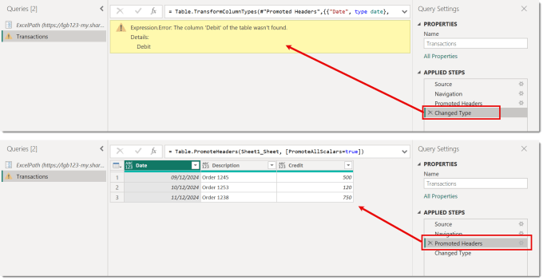
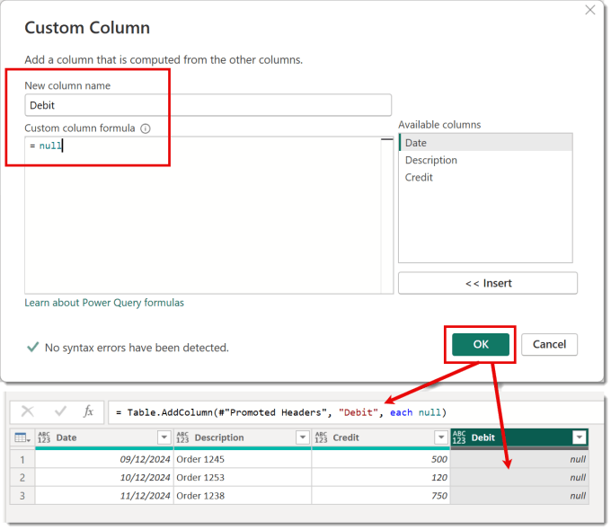
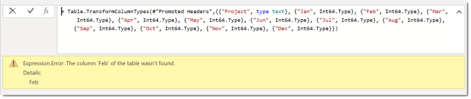
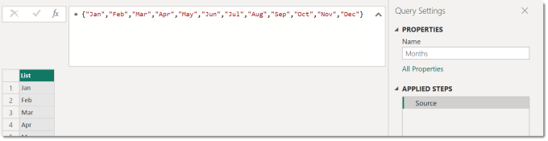
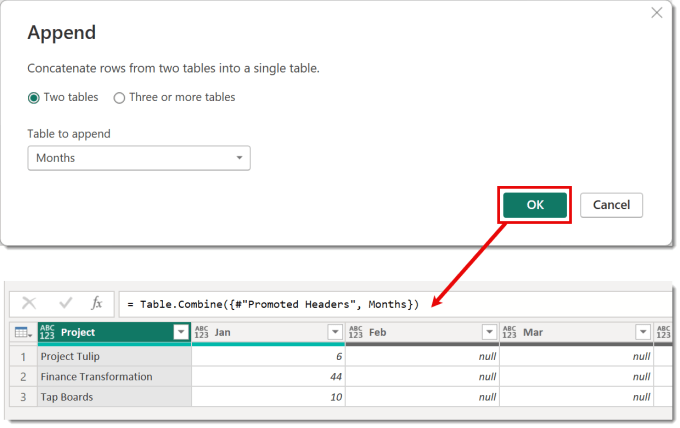

---
title: Power Query – Fixing Missing Columns Dynamically
description: One of the challenges of making sure your query works in Power Query is data sources that have a changing schema. Some APIs miss out fields if the data is null and sometimes we need one report able to handle data files that are almost the same but not quite. In this post we will look at fixing 2 scenarios, a single missing column and multiple columns missing.
slug: power-query-fixing-missing-columns-dynamically
date: 2025-01-08 11:49:26+0000
lastmod: 2025-02-13 12:03:48+0000
image: cover.png
categories:
    - M
    - Power Query
---

One of the challenges of making sure your query works in Power Query is data sources that have a changing schema. Some APIs miss out fields if the data is null and sometimes we need one report able to handle data files that are almost the same but not quite. In this post we will look at fixing 2 scenarios, a single missing column and multiple missing columns.

You know you have this problem when you get the an error similar to this:


## Single Missing Column

This scenario is fixing one column missing. In my example the query was written based on a file that had a Debit column. The query is now pointed to file that is missing that column. We need the query to work if the Debit column is in the original or not.



Start in the broken version and find the first step where there is not an error. The fix is to add the Debit column if the table does not have the column.

M is not friendly to write so lets get the interface to write part of it. Click on Custom Column on the Add Column ribbon. Click Insert when prompted about inserting a step. Then enter in the name of the missing column for the column name and null for the value. When you click OK the column gets inserted and your query goes back to working.



But the query will fail when the file does include the Debit column. So we need to add some logic to the new step we added. We need to test to see if the table already has the column, if it does just return the table, if not add the column. This can be done using Table.HasColumns function and an “if” statement.

The line of M created by the inserting a custom column is

```xml
= Table.AddColumn(#"Promoted Headers", "Debit", each null)
```

This needs to become

```xml
= if Table.HasColumns(#"Promoted Headers","Debit") 
    then #"Promoted Headers" 
    else Table.AddColumn(#"Promoted Headers", "Debit", each null)
```

Please note the #”Promoted Headers” comes from the name of the previous step.

Reference for HasColumns can be found at [https://learn.microsoft.com/en-us/powerquery-m/table-hascolumns](https://learn.microsoft.com/en-us/powerquery-m/table-hascolumns?wt.mc_id=DX-MVP-5003563)

## Multiple Missing Columns

The previous method works great for a single column and maybe even 2 but if you have more columns than that you really need another method. In this example we have a set of data with columns for months Jan – Dec. At the start of the year there is only a Jan column but we need the query to return all the columns.



The error will only complain about the first column it finds missing but if we fixed Feb it would then complain that Mar was missing etc. When you append 2 tables it creates a table with all the columns of both tables even if one table does not contain any data. So if we can create an empty table with all the columns we want and then append the tables we will get all the columns added.

Create a new blank query and enter in the formula to create a list of all the column names you want to make sure exist. Use {} brackets containing the column name strings separated by commas. This will display the list of values. Rename the query to something meaningful, for example Months.

```xml
= {"Jan","Feb","Mar","Apr","May","Jun","Jul","Aug","Sep","Oct","Nov","Dec"}
```



Now we need to add a step that converts this into a table. Right click on the Source step and select Insert Step After. Next we use #table function that takes 2 parameters, list of columns and values. We want an empty table so will use {} for the values. Change the formula to the following

```xml
= #table( Source , {} )
```


Reference for #table can be found at [https://learn.microsoft.com/en-us/powerquery-m/sharptable](https://learn.microsoft.com/en-us/powerquery-m/sharptable?wt.mc_id=DX-MVP-5003563)

Return to the broken query and find the last step that the query works. On the Home ribbon select Append Queries and select Insert when prompted about inserting a step. In the Append dialog select the query that has the empty table just created. Then click OK. Your query now has all the columns required and should work if the columns are missing columns or not



## Advanced Notes on Missing Columns

When appending 2 tables the first table columns will come first and in the order of the first table. So if you wish to order the columns of the query as well make sure your blank table query contains all the columns and the swap the order of the tables named in the Table.Combine step.

The list of column names and creating the blank table could be put as steps within the original query. That requires being comfortable with the Advanced editor and writing M. For those interested here is an example query.

```xml
let
    Source = Excel.Workbook(Web.Contents(ExcelPath), null, true),
    Sheet2_Sheet = Source{[Item="Sheet2",Kind="Sheet"]}[Data],
    #"Promoted Headers" = Table.PromoteHeaders(Sheet2_Sheet, [PromoteAllScalars=true]),
    AllColumns = {"Project","Jan","Feb","Mar","Apr","May","Jun","Jul","Aug","Sep","Oct","Nov","Dec"},
    BlankTable = #table( AllColumns , {} ),
    #"Appended Query" = Table.Combine({BlankTable, #"Promoted Headers"}),
    #"Changed Type" = Table.TransformColumnTypes(#"Appended Query",{{"Project", type text}, {"Jan", Int64.Type}, {"Feb", Int64.Type}, {"Mar", Int64.Type}, {"Apr", Int64.Type}, {"May", Int64.Type}, {"Jun", Int64.Type}, {"Jul", Int64.Type}, {"Aug", Int64.Type}, {"Sep", Int64.Type}, {"Oct", Int64.Type}, {"Nov", Int64.Type}, {"Dec", Int64.Type}})
in
    #"Changed Type"
```

## Conclusion

Queries should be dynamic when required and missing columns is a common issue. Writing M is not friendly, writing dynamic M takes practice but it is worth it. Power Query that copes with your unclean data is the reality of handling data. Bast of luck I hope this helped.

## More Power Query Posts

- [Custom Handwritten Function](https://hatfullofdata.blog/power-query-handwritten-function/)

- [Multi-step Function](https://hatfullofdata.blog/power-query-multi-step-function/)

- [Replace Values for Whole Table](https://hatfullofdata.blog/power-query-replace-values-for-whole-table/)

- [AI Insights Error](https://hatfullofdata.blog/power-query-ai-insights-error/)

- [VBA to Edit a Parameter Value](https://hatfullofdata.blog/excel-power-query-vba-to-edit-a-parameter-value/)

- [Dynamic Data Source and Web.Contents()](https://hatfullofdata.blog/power-query-dynamic-data-source-and-web-content/)

- [Get Previous Row Data](https://hatfullofdata.blog/power-query-get-previous-row-data/)

- [Creating New Parameters](https://hatfullofdata.blog/power-query-creating-new-parameters/)

- [Fixing Missing Columns Dynamically](https://hatfullofdata.blog/power-query-fixing-missing-columns-dynamically/)

- [Handling Null Values Properly](https://hatfullofdata.blog/power-query-handling-null-values/)

