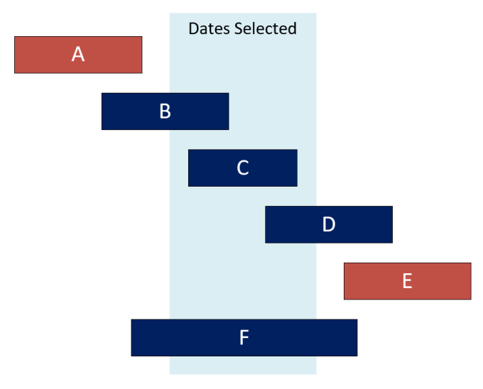
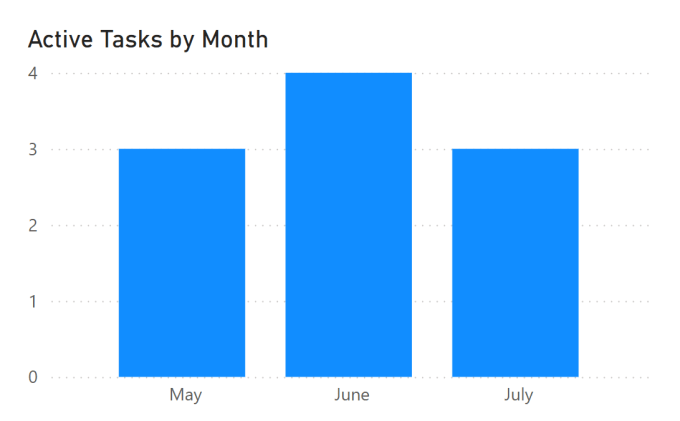

---
title: Power BI – Counting Active records easily
description: Recently in a few Power BI projects and training courses we’ve needed to create a measure for counting active records based on start and end dates for a time period. This has varied from active projects, active employees to active contracts. All of them have had the common feature of start and end dates. Scenario Task Start End A 01-May...
slug: power-bi-counting-active-records-easily
date: 2025-09-15 16:58:48+0000
lastmod: 2025-09-15 16:58:51+0000
image: cover.png
categories:
    - Power BI
    - DAX
---

Recently in a few Power BI projects and training courses we’ve needed to create a measure for counting active records based on start and end dates for a time period. This has varied from active projects, active employees to active contracts. All of them have had the common feature of start and end dates.

## Scenario



|Task|Start|End|
|---|---|---|
|A|01-May|20-May|
|B|15-May|15-Jun|
|C|5-Jun|25-Jun|
|D|20-Jun|20-Jul|
|E|10-Jul|25-Jul|
|F|25-Jun|15-Jul|

We have 6 tasks A-F. We want to know how many tasks are active in June. In the list in table above and shown in the image the 2 that don’t count are task A, that finishes before June starts and task E that starts after June finishes. I have a separate calendar table called Calendar.

Understanding the logic of the filters needed is important when writing a measure. For a task to be active in a period, the task must finish after the start of the period and the task must start before the period ends.

## DAX Code for counting Active Records

In DAX we are going to use CALCULATE function to apply the above filters. _MinDate and _MaxDate give us the start and end of the period.

```xml
Active Tasks = 
VAR MinDate = MIN('Calendar'[Date])
VAR MaxDate = MAX('Calendar'[Date])
VAR Result = 
    CALCULATE(
        COUNTROWS(Tasks),
        Tasks[Finish] >= MinDate,
        Tasks[Start] <= MaxDate
    )
RETURN Result
```

This code does not rely on any relationships between the tasks and calendar tables. If there is a relationship that is altering the calculation a CROSSFILTER function can be used to set the relationship to None.

It can be used in a chart to show 3 active tasks in May, 4 in June and back to 3 in July.



This is a simple example of using CALCULATE and creating a useful measure. One I’ve taught a few times and promised to document.

## Resources

- [Calculate Function on Microsoft Learn](https://learn.microsoft.com/en-us/dax/calculate-function-dax?wt.mc_id=DX-MVP-5003563)

- [Crossfilter Function on Microsoft Learn](https://learn.microsoft.com/en-us/dax/crossfilter-function-dax?wt.mc_id=DX-MVP-5003563)

- [Crossfilter on this blog](https://hatfullofdata.blog/power-bi-dax-crossfilter-function/)

## Conclusion on Counting Active Records

Yes this is another post on me being lazy to answer a question I end up answering lots. Understanding how you can use CALCULATE and how to work out the right filters for your logic is the crux of understanding quite a bit of DAX. Something I am still learning every day still working on.

