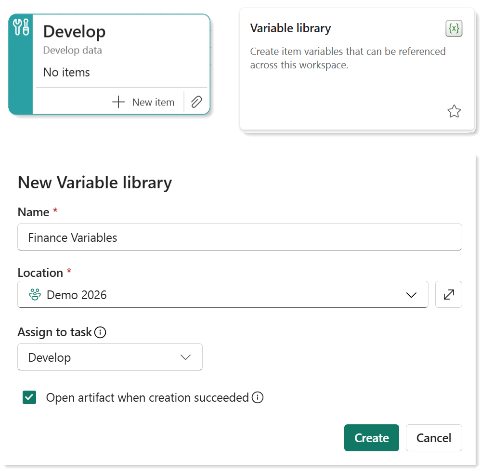
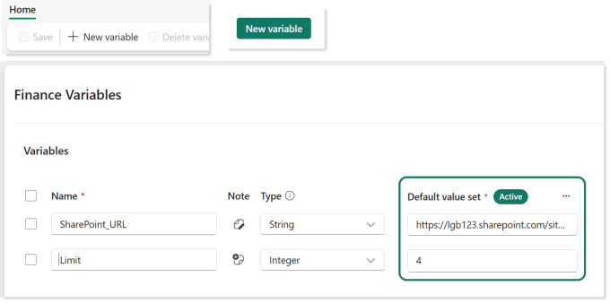
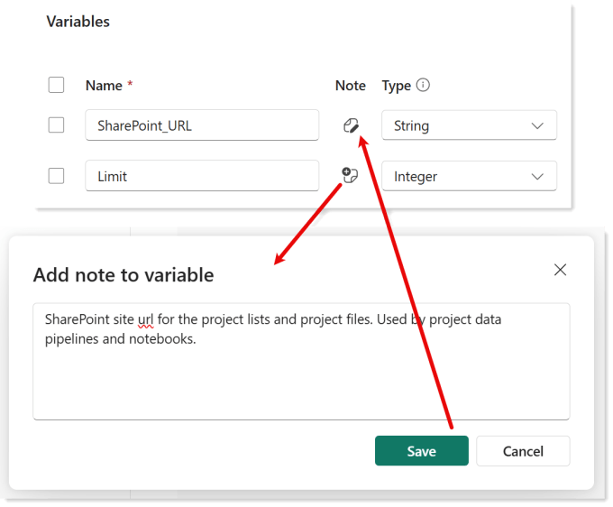

This post to help you get started creating a variable library. When multiple dataflows, notebooks and pipelines are using the same details to perform tasks it helps if those values are stored in one place. When you move to use deployment pipelines and those values change from your development workspace to your test workspace to your prod, it helps if that is easy. The solution in Microsoft Fabric is a Variable Library to store those common values.



## Create a Variable Library

This post assumes the workspace is backed with a Fabric capacity. A trial capacity works just fine.

Either from a Develop task add item or from the Add item button select Variable Library. Enter in a meaningful name for the variable library, letters, numbers and spaces are allowed. Then click the Create button and your new library will be opened. I recommend you create a naming convention that all your Fabric developers like and agree to use.

## Add a Variable

Your library starts empty, so the next task is to add variables. You can create a new variable row by clicking on + New Variable on the Home ribbon. When there are no variables there will also be a green button in the center of the page to create a new variable.

Enter in a meaningful name and select a data type. A name can only include letters, numbers and underscores. An incorrect name will prevent the library from being saved. Please note some types are not usable in some Fabric artifacts, no I haven’t worked out the logic yet but I’m working on it. Enter in a value for the Default value set. Value sets are used when you are using deployment pipelines for the different values you use development,test and production workspaces. Creating and using variable sets will be covered in another post.

## Adding Notes

So that “future you” doesn’t hate the “current you”, it is worth adding notes to variables to explain the purpose of the variable. This should be part of the best practice rules for Fabric development.

Click on the icon in the note column. When there is no note it has a plus symbol and when there is a note it has a pencil symbol.

## Saving

Variable libraries do not auto-save. You need to click the save button on home ribbon. Indicators of black dots will show unsaved items you have open and the save button will only be active when there are changes to save.

## Conclusion

I highly recommend starting any Fabric project with creating a variable library. Then everytime a value is used in an artifact such as a database name, key vault name etc a descision is made on if it should be in the variable library or if the value is already there. Some values to be more useful will need to be split across multiple variables.

It should always be assumed that a workspace with Fabric items will eventually be in a deployment pipeline. This means that it should be coded to make deployment easier. The aim of these articles is for quick reference on how variable libraries are used across all the artifacts.

## References

Microsoft have some getting started articles on setting up a variable library and using it in a deployment pipeline.

- [Microsoft Learn Variable Libraries](https://learn.microsoft.com/en-us/fabric/cicd/variable-library/variable-library-overview?wt.mc_id=DX-MVP-5003563)

