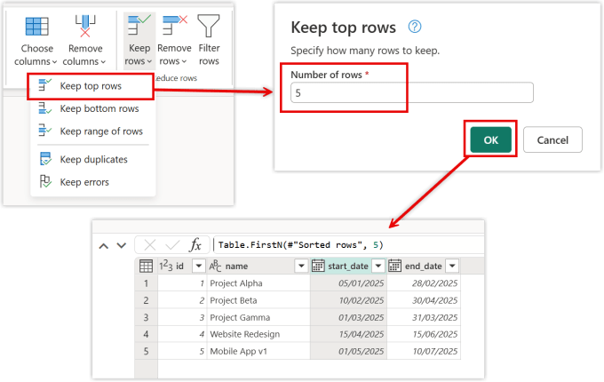
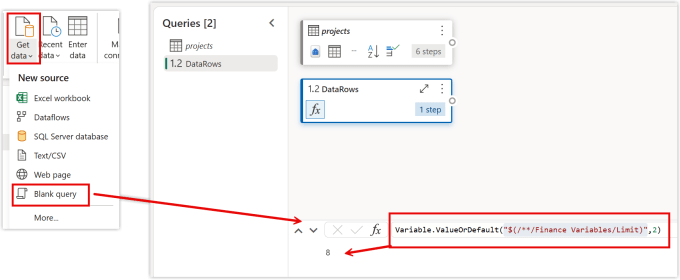
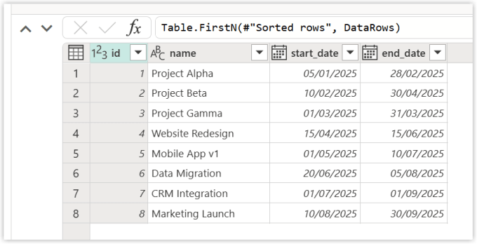

---
title: Using Variable Library in a Dataflow
description: One of the popular low-code tools within Microsoft Fabric is the Gen2 Dataflow. Power BI report builders already know some Power Query. So armed with this knowledge is a popular starting point to load data into Microsoft Fabric. Adding values from the Variable Library in a Dataflow is an obvious plan to make it more future proof and to work...
slug: using-variable-library-in-a-dataflow
date: 2026-02-11 17:21:24+0000
lastmod: 2026-02-11 17:21:27+0000
image: cover.png
categories:
    - Dataflows
    - Microsoft Fabric
    - Variable Libraries
tags:
    - "2025-2026"
---

One of the popular low-code tools within Microsoft Fabric is the Gen2 Dataflow. Power BI report builders already know some Power Query. So armed with this knowledge is a popular starting point to load data into Microsoft Fabric. Adding values from the Variable Library in a Dataflow is an obvious plan to make it more future proof and to work better with Deployment pipelines.

I will confess the first time I tried these I could not get them to work till I read the instructions correctly. So they do work just understand the limitations!

## Using Variable Libraries

Variable libraries should be part of every project. This post is part of my series to help get you started creating the library and then using the variables and finally seeing your hard work pay back when it comes to deployment pipelines.

- [Getting Started with Variable Libraries](https://hatfullofdata.blog/variable-library/)

- [Variable Values in a Fabric Notebook](https://hatfullofdata.blog/accessing-a-variable-library-in-a-notebook/)

- [Variable Values in a Data Pipeline](https://hatfullofdata.blog/using-a-variable-library-in-a-data-pipeline/)

- [Variable Values in Lakehouse Shortcuts](https://hatfullofdata.blog/using-a-variable-library-in-lakehouse-shortcuts/)

- [Variable Values in Dataflows](https://hatfullofdata.blog/using-variable-library-in-a-dataflow/)

- Variable Libraries in Deployment Pipelines

## Scenario

For this post we are going to use the scenario of a dataflow query that lists projects. Whilst we are developing the data handling we want to limit the number of rows loaded and in production we will have no limit.



I create the dataflow and then using Keep Rows, I select Keep top rows. In the next dialog I enter 5 and click OK. This results in a table with only 5 rows of data. The number of rows though needs to come from the variable library.

## Getting the Value

The next step is to get the value from the variable library into the dataflow. We are going to use a new Power Query function for this called **Variable.ValueOrDefault**. For the first parameter of this function, you need the Variable Library name and a Variable name. Then you combine together in a string.

```xml
"$(/**/<Library Name>/<Variable Name>)"
```

So for my example the string will be **“$(/\*\*/Finance Variables/Limit)”**.



On the Home ribbon, expand Get data and select Blank query. I renamed the query to DataRows. Then in the formula bar enter in the code below. This will return the current value of the variable in the library. The documentation as of publishing this post states it won’t work hence we use the OrDefault function and in this example the default is 2. It does work though, and we can see the answer 8 comes through.

```xml
Variable.ValueOrDefault("$(/**/Finance Variables/Limit)",2)
```

## Using the Variable Value

We’ve got the variable value from the variable library in a dataflow, now we need to use it. In the last line of my project query that limited the query to 5 rows I can replace the 5 with DataRows. I now get 8 rows of data.



This works as long as we always want to limit the rows, the chances are in production we don’t want to limit, so I add the extra of only limit if DataRows is greater than 0. Here is my new statement, the previous step is call Sorted Rows hence the #”Sorted rows”

```xml
if DataRows > 0 then Table.FirstN(#"Sorted rows", DataRows) else #"Sorted rows"
```

## References for Variable Library in a Dataflow

[Microsoft – Use Fabric variable libraries in Dataflow Gen2](https://learn.microsoft.com/en-us/fabric/data-factory/dataflow-gen2-variable-library-integration?wt.mc_id=DX-MVP-5003563)

[Power Query Reference for Variable.ValueOrDefault](https://learn.microsoft.com/en-us/powerquery-m/variable-valueordefault?wt.mc_id=DX-MVP-5003563)

## Conclusion on using variable library in a dataflow

Its great we can bring in the values easily. Its a shame that we can’t use them to control the destination, but that is on the road map for 2026 Q1. I’ll blog about it as soon as it arrives! I highly recommend using my pattern of fetching the value as a query and then referring to that. It will help in debugging etc.

