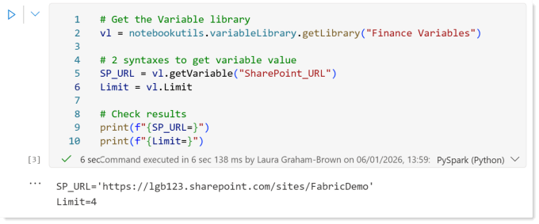
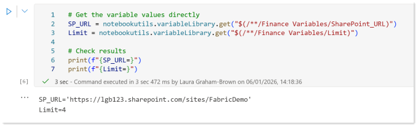

---
title: Accessing a Variable Library in a Notebook
description: This post walks through how to access a variable library in a notebook in Microsoft Fabric. I recommend a Microsoft Fabric project starts by creating a variable library to store the common values different artifacts need and could be changed if a deployment pipeline gets involved. So when we create a notebook we need to be able to use these...
slug: accessing-a-variable-library-in-a-notebook
date: 2026-01-12 09:34:51+0000
lastmod: 2026-01-12 10:51:34+0000
image: cover.png
categories:
    - Microsoft Fabric
    - Notebooks
    - Variable Libraries
---

This post walks through how to access a variable library in a notebook in Microsoft Fabric. I recommend a Microsoft Fabric project starts by creating a variable library to store the common values different artifacts need and could be changed if a deployment pipeline gets involved. So when we create a notebook we need to be able to use these variables. This means we need load the variable library in a notebook and then get the variable values.



## Connect to Library

The first task is to create a variable for the variable library. The notebookutils package includes the functions we need to do this easily. In the code below the variable vl will refer to the variable library that is called “Finance Variables”. This code assumes the notebook is in the same workspace as the library.

```xml
# Get the Variable library
vl = notebookutils.variableLibrary.getLibrary("Finance Variables")
```

## Get Variable Value

Once we have the variable library loaded, we can access the variable values in one of two syntaxes.

```xml
# 2 syntaxes to get variable value
SP_URL = vl.getVariable("SharePoint_URL")
Limit = vl.Limit
```

Combining both of the two and adding some print statements we can demo the above using this code.

```xml
# Get the Variable library
vl = notebookutils.variableLibrary.getLibrary("Finance Variables")

# 2 syntaxes to get variable value
SP_URL = vl.getVariable("SharePoint_URL")
Limit = vl.Limit

# Check results
print(f"{SP_URL=}")
print(f"{Limit=}")
```

And here is the run



## Get a variable value by reference

There is a third way to get a variable value. The get method from notebookutils variable library uses a reference string that follows the following syntax:

```xml
"$(/**/<LIBRARY NAME>/<VARIABLE NAME>)"
```

Before you get excited that the ** implies you could refer to another workspace, sorry that is not supported. This string is used in the variableLibrary.get action in notebookutils. For example to get the two values from before could be done like this

```xml
# Get the variable values directly
SP_URL = notebookutils.variableLibrary.get("$(/**/Finance Variables/SharePoint_URL)")
Limit = notebookutils.variableLibrary.get("$(/**/Finance Variables/Limit)")
```

And here is the run



> [!TIP]
> The print(f"{Limit=}") prints Limit=4 for us newbies to Python!

## Naming Conventions

When you start and there are only 4 variables in the library its easy to remember the names to type in by hand when you are using a variable library in a notebook. When it gets to 20 names, its harder. So create standards, whats the case pattern, you using _ between words or not? Pick a set of rules and stick with it, BronzeWorkspaceID works just as well as Bronze_Workspace_ID, WorkspaceID1 and workspace_id2 are a technical debt you don’t need.

## Conclusion on using Variable Library in a Notebook

I’m really impressed on how easy it is to use the variable library in a notebook. The pattern is simple and resusable. If I had a magic wand it it would be great is the intellisense knew the variable names from loading the variable library object.

The method by reference is great if you want to dynamically select which variable to load as the string could be dynamically built.

Using a combination of parameters and accessing a variable library means reusable notebooks are easier to write. This needs to become part of the best practice pattern being used.

## References

Microsoft learn covers Variable library utilities as part of the notebook utilities page.

[https://learn.microsoft.com/en-us/fabric/data-engineering/notebook-utilities#variable-library-utilities](https://learn.microsoft.com/en-us/fabric/data-engineering/notebook-utilities#variable-library-utilities?wt.mc_id=DX-MVP-5003563)

