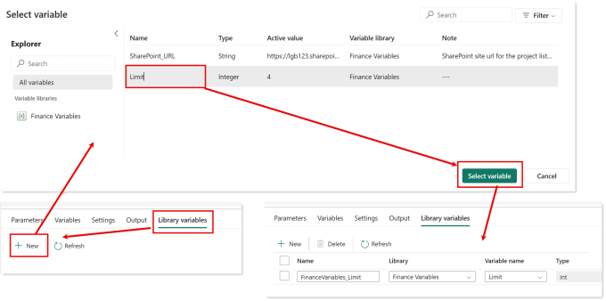
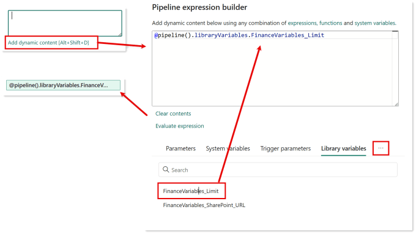
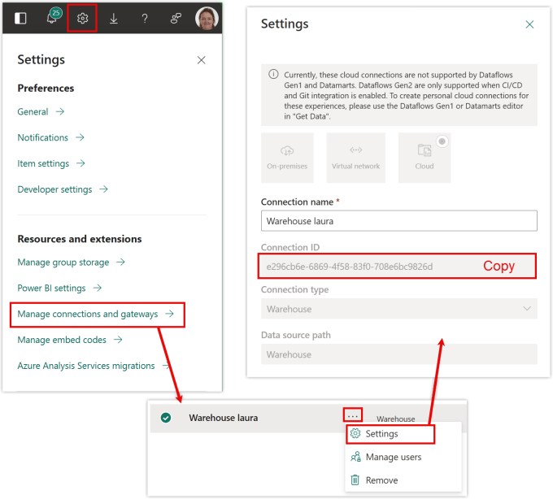
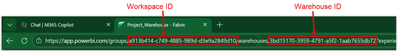
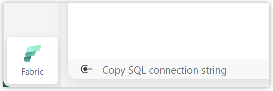
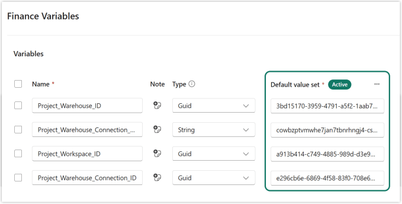
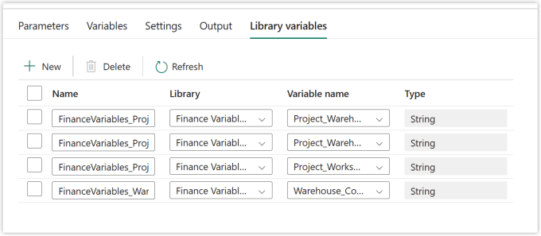
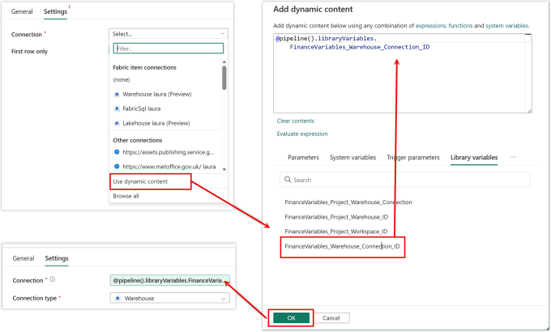
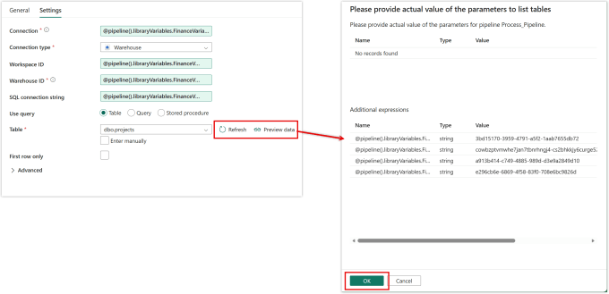

You’ve set up your variable pipeline with WorkspaceIDs and LakehouseIDs etc etc Now you want to use that variable library in a data pipeline so we can use the common values and they will behave in a deployment pipeline.



## Adding the Variables to the Data Pipeline

Before you can use the variable library in a data pipeline you need to add the variables. In your data pipeline you need to click on the grey background to bring up the section on the bottom of the screen with Parameters, Variables etc. If you are in a brand new pipeline you need to click on the settings cog first, then it will appear.

Select the Library Variables section. Then click on +New and the select variable dialog box appears. If you have multiple variable libraries you can select the right one, you can also search for a variable in the top right. Once you select a variable click on Select Variable button to add that variable to the pipeline.

Yes you have to add each variable in turn, no multi-select. You can rename the variables but please don’t, name your variables in your library better.

## Using Variable Values

You can use the variable values anywhere you can use Dynamic Content. Click on the Add Dynamic content link to open the Pipeline expression builder. Click on the three dots to select Library variables. Click on the variable value you want to use to enter in the formula into the expression. Click OK to put the formula back into the box.

You can use the variable value inside any functions if required.

## Using Variables for Data Connections

When a data pipeline move from a dev workspace to test workspace and then onto production workspace we need to change the details of the connections to the new values. For this post we will use a connection to a Fabric warehouse in a workspace. I want to pull the values from a table in the warehouse using a lookup action.

I need to create the following variables in the library:

- Project_Warehouse_Connection_ID

- Project_Workspace_ID

- Project_Warehouse_ID

- Project_Warehouse_Connection_String

### Connection IDs

For the connection guid you need to click on the cog on the top bar and select Manage connections and gateways. From the list of connections, find the one you are using. From the three dots menu select settings. The Connection ID will be listed and can be highlighted and copied.

### Workspace, Warehouse and Lakehouse IDs

IDs for most artifacts can be found when it is opened. Be aware groups=workspaces in the url. Lakehouses have 2 IDs, one for the lakehouse and one for the SQL analytics endpoint or lakewarehouse as the url names it. No comment on names to confuse us!

### Connection String

The final part needed is the connection string for the warehouse or lakehouse. The easiest way to copy this is to open the lakehouse SQL endpoint or the warehouse and in the bottom left hand corner is a Copy SQL connection string link.

It can also be found in the lakehouse or warehouse settings under SQL analytics endpoint.

### Variable Library

All these values need saving into the Variable Library. I’ve used Guid for the IDs and String for the connection string.

## Using the Variables in the Activities

We now need to use the variable values from the variable library in a data pipeline activity connection. We start by adding all 4 variables to the library. Note the guids become strings.

In this post for simplicity I’m using a Lookup activity to just get all the rows from the projects table. So I add a lookup activity and fill in the general details. On the Settings tab I click the drop down for Connection and select Use dynamic content. In the Add dynamic content pane I find Library Variables under the three dots and select FinanceVariables_Warehouse_Connection_ID so it appears in the expression box. Then I click OK for the Connection to now be an expression.

Once the connection has been populated you can select the connection type, in my case Warehouse. Then the text boxes appear to take the Workspace ID, Warehouse ID and SQL Connection string. They all have a link to Add dynamic content.

The table drop down can be populated by entering manually or by clicking Refresh. This will open a pane showing the values that are going to be used in the connection. Click OK to start it fetching the list of tables. Once a table is selected if you click Preview data the same pane appears confirming values. Its a great way to test the connection works.

You now have a variable values from a variable library in a data pipeline activity. Well done!

## Conclusion on Using a Variable Library in a Data Pipeline

I like how simple it is to use the variables and that you get to select the variables needed in this data pipeline. I’d prefer if you could add multiple variables at a time. I like the consitent use of the expression builder so its something we get familiar with.

I’d also really like it if in lineage view you could see which artifacts are using of the variable library and the impact was also included. Maybe oneday!

## Resources

[https://learn.microsoft.com/en-us/fabric/data-factory/variable-library-integration-with-data-pipelines](https://learn.microsoft.com/en-us/fabric/data-factory/variable-library-integration-with-data-pipelines?wt.mc_id=DX-MVP-5003563)

