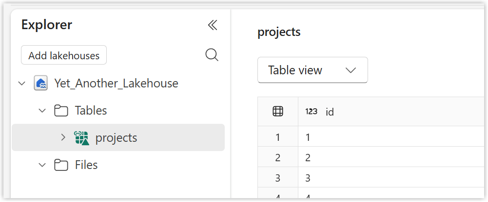
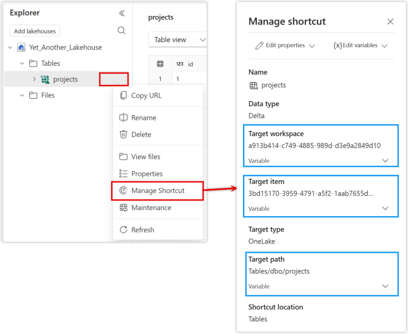
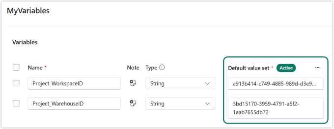
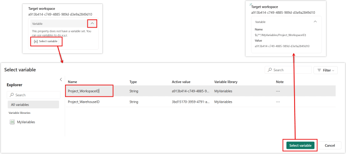
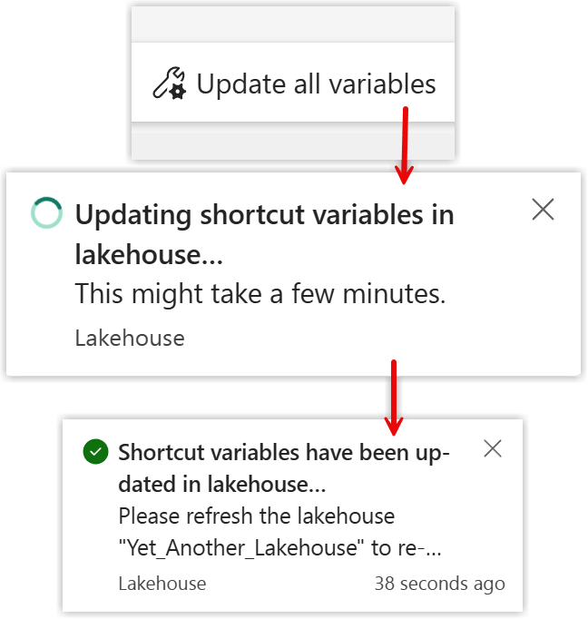
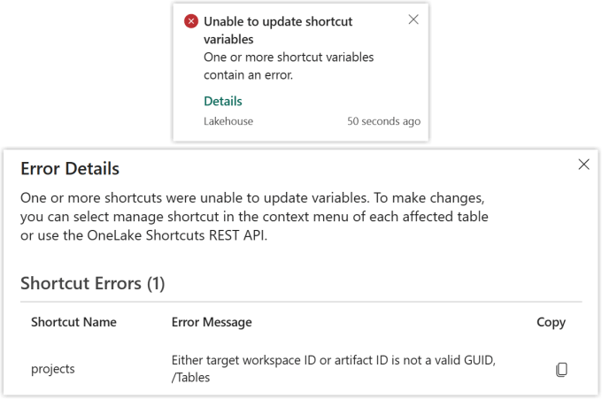

Lakehouse shortcuts are a popular addition to the Fabric set of tools to access data easily without copying it. Using a variable library in lakehouse shortcuts means its easy to point shortcuts to an alternative location. This great for ALM using development, test and production workspaces.



## Setting Up the Shortcuts

Using the standard GUI you have no option to use a variable library values in the setup of the shortcuts. So set up your shortcuts as you normally and make sure they work. For this post I’m using a shortcut to a table in warehouse. (I had a whole barny with lakehouses and schemas and it not working – another post for another time!)

According to the documentation using the rest API also does not allow for the use of variables in the creation of shortcuts.

## Viewing the Options

If we select the short cut and click on the 3 dots to expand the menu we can then click on Manage Shortcut. This opens a pan that shows the values behind the shortcut. The values that be populated from a variable library have a Variable drop down, so we can see Target workspace, Target item and Target path.

I only want to populate the workspace and item guids, so I set up a those variables in my variable library. The variables must be set up as strings, they might look like guids but the shortcut demands they are strings. I set the default values to match the current values. When we apply each variables it will check the current values work so it only works if you use the current values.

## Applying the Variables

Back in the Manage Shortcut pane click on the Variable below the current value to expand that section. Then click on Select variable to open the Select variable dialog. Click on the correct variable and then click Select Variable. This will update the value to come from the variable.

Once you have pointed it to the variable there does not appear to be a method to change back to a hard coded value.

## Updating Variable Values

Variable values will get updated, the most common being a different active set being selected. For other artifacts the change will get picked up when they execute or refresh. For shortcuts this is slightly different. You need to force the updating of variables.

Open the lakehouse and stay in the lakehouse view. On the ribbon the last button is Update all variables. A message will show the updating is taking and finally there will be a notification to say they have been updated.

If one of the shortcut fails in the update please be aware the successful ones will have updated. You do get a notification and an error message that tries to help.

## Conclusion on Variable Library in Lakehouse Shortcuts

I really like that the variable libraries can be accessed directly in the shortcut details, there is no pre-loading. I would prefer that I could change the values and then press apply so that each value isn’t checked individually. My experience in deployment pipelines means I fell foul of not realising I needed to refresh the variable values.

## Resources

Creating Shortcuts – [https://learn.microsoft.com/en-us/fabric/data-engineering/lakehouse-shortcuts](https://learn.microsoft.com/en-us/fabric/data-engineering/lakehouse-shortcuts?wt.mc_id=DX-MVP-5003563)

Microsoft Learn – [https://learn.microsoft.com/en-us/fabric/onelake/assign-variables-to-shortcuts](https://learn.microsoft.com/en-us/fabric/onelake/assign-variables-to-shortcuts?wt.mc_id=DX-MVP-5003563)

