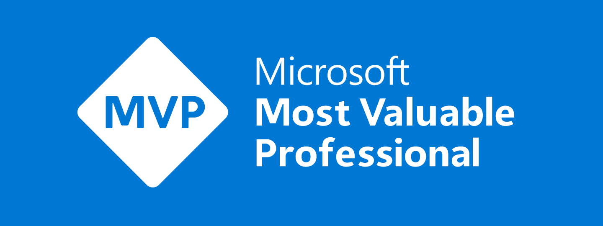

Today I got the news I get to be a Data Platform MVP for another year!

As tradition dictates I am of course Humbled and Honoured. In reality though, I'm hugely grateful to lots of people who let me be me in this community.

- Hosts of user groups and conferences who create the place for us to meet and present
- Helpers who make conferences work, tell me when to end a session and help me find my room
- Humans who came to my sessions, read my blog, watched my youtube channel, asked questions and made it feel worth while. If any non-humans were involved I am of course grateful to them as well.
- Hecklers1
- Handful of friends who have shared the highs, the hurdles, headaches and the hilarity of another year in tech.
- Hubby, Harry, who has done the airport drop offs and pickups, cooked while I build slides and demos, never complains when head off to another conference or user group.

Turns out H is a great letter.

The award comes with a badge, an updated one this year, but in reality the award opened doors for me to an amazing community. We use the ever changing, name changing, icon changing2 tech as an excuse to gather, but we stay because of the community of wonderfully diverse, usually neurodivergent and amazing humans we are.

A huge thank you to my co-speakers this year Claire Edgson, Joe Griffin, Lewis Baybutt and Will Johnson. We rocked!

Also to Mark Pryce-Mayer who makes me laugh and fixes the lakehouses I break, Sue Bayes who makes me smile every week, Alex Powers who encouraged me to keep going, Ian Tweedie who helped me transfer my blog from wordpress to Hugo, so blogging will again be enjoyable and Ash Graham-Brown who did the accessibility work to make sure a screen reader makes some sense on my blog.

And last, but never least, Rie Merritt who looks after us Data Platform MVPs, keeps us in line and always supports us non-males in a male dominated industry.

My advice to anyone looking in on the community, unsure how to join, please reach out. Come talk to a speaker after a session, ask the questions, be brave and say hello. Many of us are incredibly shy, anxious and imposter syndrome is our best skill, so we understand your shyness. You are one of us, I promise. Take a look at my [Upcoming Events page](https://hatfullofdata.blog/upcoming-events/) and if you are going to be at one of them reach out to me beforehand and we can have a coffee together and I'll introduce to people you want to meet.

1 You know who you are 
2 Microsoft stop it!