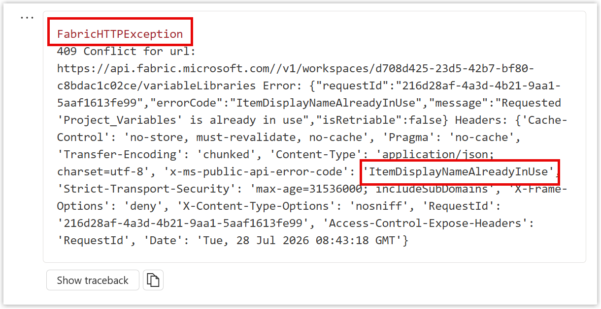

So in order to do my variable library series and demos for workshops I've had to build by hand quite a few variable libraries and I got bored. Then by chance I came across Sempy-Labs updating values in a variable library. So after exploring for a bit and finally getting some code to work, I wrote this blog post as my notes.



## Semantic Link Labs

Semantic Link Labs is a Python library to extend the capabilities of Semantic Link. Semantic Link allows you to link into a semantic model from a notebook. Its a separate library and offers plenty of opportunities to make changes to Microsoft Fabric from within a notebook.

Here are some references

* [Semantic Link Labs on GitHub](https://github.com/microsoft/semantic-link-labs)
* [Semantic Link Documentation](https://semantic-link-labs.readthedocs.io/en/0.16.0/index.html)
* [What is Semantic Link](https://learn.microsoft.com/en-us/python/api/semantic-link/overview-semantic-link?view=semantic-link-python)

> [!NOTE]
> All of the code in this post can be run using a Python Kernel notebook. You don't have to use PySpark.

## Loading the Library

The library is called sempy_labs and we want the sub-module variable_library. It is not one of the default libraries installed so it usually cannot just be imported so there a good possibility you need to use a %pip statement to install it into your environment. So we try an import and if that fails with ModuleNotFoundError we use the %pip command to install.

In short the loading library code block should be this and we can then use ```variable_library.create_variable_library```

```python
try:
    from sempy_labs import variable_library
except ModuleNotFoundError:
    %pip -q install semantic-link-labs -U
    from sempy_labs import variable_library
```

## Create Empty Library

Stage one is to create an empty variable library. For this all we need a variable library name, for the variables and value sets we will start with empty dictionaries. So our code is as follows

```python 
vl_Name = "Project_Variables"

variable_library.create_variable_library(
    name = vl_Name,
    variables = [],
    value_sets = []
)
```

When the code runs we should get a confirmation message to say it was created. We would have also added a description and a workspace plus folder name. With no workspace specified the workspace of the notebook is used.


## Adding Variables

The variable library created by the above code is empty. The Sempy-Labs library does not currently have a method to edit the definition so we have to add the variables and value sets at creation.

So we need to create a dictionary for the variable definitions.

```python {linenos=inline hl_lines=["3-15", "19"] style=emacs}
vl_Name = "Project_Variables"

variables = [
    {
        "name":"RowLevel",
        "note":"How many rows of data",
        "type":"Integer",
        "value":5
    },
    {
        "name":"SharePointURL",
        "type":"String",
        "value":"https://mycompany.sharepoint.com/sites/FabricDemo"
    }
]

variable_library.create_variable_library(
    name = vl_Name,
    variables = variables,
    value_sets = []
)
```

The note value is optional, name, type and value are required. So we the variables definition before the create and we get a library with 2 variables.


## Adding Value Sets

The next obvious step is to add value sets. The definition for value sets includes a name and a list of the variable overrides. For example we might have a Test value set where the RowLevel is set to 10 but the SharePointURL stays the same.

```python {linenos=inline hl_lines=["18-28", "34"] style=emacs}
vl_Name = "Project_Variables"

variables = [
    {
        "name":"RowLevel",
        "note":"How many rows of data",
        "type":"Integer",
        "value":5
    },
    {
        "name":"SharePointURL",
        "note":"Full path",
        "type":"String",
        "value":"https://mycompany.sharepoint.com/sites/FabricDemo"
    }
]

value_sets = [
    {
        "name":"Test",
        "variableOverrides":[
            {
                "name":"RowLevel",
                "value":10
            }
        ]
    }
]


variable_library.create_variable_library(
    name = vl_Name,
    variables = variables,
    value_sets = value_sets
)
```

This creates the variable library with one value set called Test which has a different value for RowLevel.


## Error Handling

If you run the code twice, not surprisingly the code fails. A library with that name already exists. The error is a FabricHTTPException and buried in the text is the text "ItemDisplayNameAlreadyInUse". 




```python {linenos=inline hl_lines=["30-42"] style=emacs}
vl_Name = "Project_Variables"

variables = [
    {
        "name":"RowLevel",
        "note":"How many rows of data",
        "type":"Integer",
        "value":5
    },
    {
        "name":"SharePointURL",
        "note":"Full path",
        "type":"String",
        "value":"https://mycompany.sharepoint.com/sites/FabricDemo"
    }
]

value_sets = [
    {
        "name":"Test",
        "variableOverrides":[
            {
                "name":"RowLevel",
                "value":10
            }
        ]
    }
]

from sempy.fabric.exceptions import FabricHTTPException

try:
    variable_library.create_variable_library(
        name = vl_Name,
        variables = variables,
        value_sets = value_sets
    )
except FabricHTTPException as e:
    if "ItemDisplayNameAlreadyInUse" in str(e):
        print(f"❌ {vl_Name} already exists")
    else:
        raise    
  
```

To match that error we need to import it from the sempy library in line 30 and then wrap the create in a try statement. The test to look for ItemDisplayNameAlreadyInUse means a more friendly error message will be displayed.


## Conclusion

For me this was a great introduction to the Sempy Labs library. It gives me the possibility to script the setting up of demos. I wish there was a way to update the definition of the library so we could script adding a value set to an existing library and I have put in a request. But for now we can't via Sempy Labs. We can though via Rest API using this reference [Items - Update Variable Library Definition](https://learn.microsoft.com/en-us/rest/api/fabric/variablelibrary/items/update-variable-library-definition?wt.mc_id=DX-MVP-5003563) But that would be a whole new blog post!