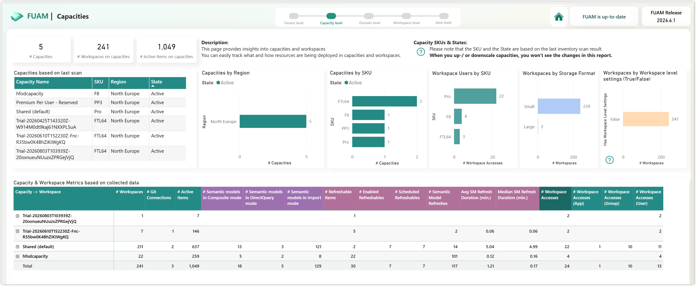

FUAM stands for Fabric Unified Admin Monitoring. It is a community-driven tool designed for Power BI and Microsoft Fabric administrators to track tenant settings, monitor capacity usage, audit user activities and manage data governance. Its a great starting place to do monitoring.

I won't walk through the setting up of FUAM, they have great instructions here [FUAM Deployment](https://github.com/microsoft/fabric-toolbox/blob/main/monitoring/fabric-unified-admin-monitoring/how-to/How_to_deploy_FUAM.md)

## Can you hear the but coming?

Its a great but it only looks at dedicated capacity, ignoring the shared capacity. This post walks through the changes I make to FUAM to make it also include the workspaces on shared capacity.

## High Level Solution

Throughout this solution I will add a boolean parameter called **dedicated_only** so that filter strings can be created and code can be executed based on the value.

In the capacities I will add a manual row for the Shared Pro capacity if dedicated_only is false. In the workspaces pipeline I will set the filter parameter based upon dedicated_only value and replace the null values in the capacity id column with the id of the inserted row

## Capacities

There is a pipeline called Load_Capacities_E2E that uses a copy data activity to call the api to create a json file. It then runs a notebook that writes a silver layer table in the FUAM_Staging_Lakehouse and then merges that into a gold table in FUAM_Lakehouse called capacities.

I add the dedicated_only parameter to the pipeline and to the notebook book.


On the notebook activity in the pipeline I add the parameter under base parameters on the settings tab.


Lastly in the notebook I add a new code block, after cell 10 and before the write to silver delta table. The shared capacity needs to have a region assigned. It is the region of the home tenancy. I could not find an api to give me that detail, but the PP3, premium per user capacity is also in the home region so I used that to get the region. If there isn't a PP3 then I set the region to unknown.

```python
# Add Shared capacity
if not dedicated_only:
    # Get Home Region from PP3 row
    pp3_region_row = (
        silver_df.filter(col("sku") == "PP3").select("region").limit(1).collect()
    )
    if not pp3_region_row:
        pp3_region = "Unknown"
    else:
        pp3_region = pp3_region_row[0]["region"]

    if display_data:
        print(pp3_region)

    # Create Shared Capacity Row
    shared_row =[{
        "admins": [],
        "capacityUserAccessRight": "Admin",
        "displayName": "Shared (default)",
        "CapacityId": "00000000-0000-0000-0000-000000000000",  
        "region": pp3_region,
        "sku": "Pro",
        "state": "Active",
        "users": []    
    }]

    # Convert to dataframe
    shared_df = spark.createDataFrame(shared_row, schema=silver_df.schema)

    # Append to silver_df
    silver_df = silver_df.unionByName(shared_df)

    if display_data:
        display(silver_df)
```

I then ran the pipeline to confirm it worked and then checked the FUAM_Lakehouse for the Shared (default) capacity.


## Workspaces

For the workspaces there is a Load_PBI_Workspaces_E2E. On the api calls to pull the workspaces it includes a filter that only pulls workspaces based on dedicated capacity. So the solution here is to use the dedicated_only parameter again and set the value of the filter string based on it.

Just the same as the capacities pipeline I add a parameter called dedicated_only. I then add an If condition as the second activity. The expression I use dynamic values to set it to the dedicated only parameter.

For the true part I add a set variable activity that sets a new variable called dedicated_filter to the value 

```
@string('$filter=isOnDedicatedCapacity eq true&')
```

For the false part I add another set variable activity to set dedicated_filter to a blank string using

```
@string('')
```


Now the dedicated_filter variable has been set up we need to use in the 2 activities that include dedicated filters. The first one is Fetch Workspace count. Under settings take a look at the Relative URL. Change the formula to

```
@concat('groups?',variables('dedicated_filter'),'$top=1')
```


The other one to change is the nested Fetch Workspace activity in the ForEach Get Workspaces activity. Change the Relative Url to

```
@concat('groups?',variables('dedicated_filter'),'$top=',variables('limit'),'&$skip=', variables('currentSkip'))
```


If the dedicated_only parameter is set to false the above steps will pull through all the workspaces including those on the shared capacity but they will not be connected to the capacity row we added. So in order to fix this we need to replace the null values in the capacity id column.

There will only be null capacity id values if pro workspaces have been included so we can run the replaces nulls in all cases and it is just a small code addition. Edit the 02_Transfer_Workspaces_Unit notebook, the last activity in the pipeline. Add a new code block after block 8.

Also to avoid the Default Dataset Storage mde being blank I make an assumption that its either Small or Large and Large is only available for premium and Fabric capacities. So I these for assume null should be replaced with small in the DefaultDatasetStorageFormat column.

```
# Replace Nulls in Capacity Id and Default Dataset Storage Mode
silver_df = silver_df.fillna(value="00000000-0000-0000-0000-000000000000", subset=['CapacityId'])
silver_df = silver_df.fillna(value="Small", subset=['DefaultDatasetStorageFormat'])
```

The block after displays silver_df and the next block writes silver_df to a table.

Once all the changes are made run the pipeline to ensure it works.


## End to End Pipeline

The capacity and workspace pipeline are called by the Load_FUAM_Data_E2E pipeline. The new pipelines' parameter appears automatically so I just make sure that the 2 Invoke pipeline activities have the parameter set correctly in the settings tab. To follow the complete pattern this possibly should be moved to a pipeline parameter like the display_data one.


## Overall Report

Once all these changes have been made if we take a look at the reporting we can see the Shared capacity has come through. Obviously the capacity usage does not apply to the items in workspaces in the shared capacity but everything else seems to apply.

This is my very small tenancy that only exists for training, demos and blog screenshots.



## Conclusion

There are still plenty of tenancies out there with significant amounts of Pro workspaces mixed in with their Fabric and Premium workspaces and the U in FUAM does stand for unified. Let me know how you get on and what else I could do with FUAM to make it work for your situation. 