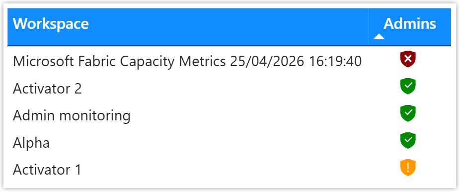

## Introduction

Conditional formatting with meaningful icons is one of my favourite ways to make a table or matrix mean something to anyone in the business. Red cross or diamond usually means something is wrong, green tick or circle means everything is okay.<sup>1</sup>  People understand that as a concept. So to make this easy I use measures and add my own custom icons

## Out of Box Conditional Formatting

Power BI has a great way to write rules to add conditional formatting to a column in a table. Sadly I hate the form, way too many clicks, way too fiddly for me. In the example shown I'm adding icons to the column showing the number of admins a workspace has. The rules match the logic of 0 admins is bad, 1-4 is good more than 4 has a warning<sup>2</sup>


## Use a Measure

When I'm doing conditional formatting on background colours I use a measure. So can I use a measure for icons? I assumed not then I came across a brilliant post on the Radacad blog site written by Reza Rad.

[https://radacad.com/power-bi-icon-names-for-conditional-formatting-using-dax/](https://radacad.com/power-bi-icon-names-for-conditional-formatting-using-dax/)

This gives all the names of the icons that come with Power BI. So my red diamond is called SignLow etc. So next I write a measure.

```
Icon Workspace Admins = 
SWITCH(
    TRUE(),
    [# Workspace Admins] = 0, "SignLow",
    [# Workspace Admins] >= 5, "SignMedium",
    "CircleHigh"
)
```

> [!TIP]
> Make sure the measure has a data type of text and format text or this won't work! Hint - Look on the measures ribbon.

I can then return to the conditional formatting and change format style to field value and select my measure for the field to base this on.


## Custom SVG Icon

So the next challenge is the list of available icons is pretty limited. With my SVG skills I want to add my own. Now I've covered before creating a column of your own with measures containing SVG. These have the disadvantage of more measures and the dax appears as a tool tip.

Then I remembered I wrote a blog post back in 2019 on adding SVG icons to a theme file, lets use that. I went to try that code out as Power BI has changed a bit since then. And sure enough it didn't work.

Then I found a video that gave me the solution. I updated my older blog post. The important part is to replace the hash (#) before any colour hex codes with %23.

YouTube Video [https://www.youtube.com/watch?v=lfqPpUdtTss](https://www.youtube.com/watch?v=lfqPpUdtTss)

My Old Blog Post - [https://hatfullofdata.blog/svg-in-power-bi-7-using-theme-file-svg-icons/](https://hatfullofdata.blog/svg-in-power-bi-7-using-theme-file-svg-icons/)

I had three icons I liked


From these I made a theme file. Note that the SVG needs to be a single line for each icon and the colour hex codes start with %23. Remember to replace " with ' inside your SVG. And this can be added to an existing theme file. Load the theme file into you Power BI report.

```JSON
{
    "name": "New Icons",
     "icons": {
          "ShieldRedError": {
               "url": "data:image/svg+xml;utf8, <svg xmlns='http://www.w3.org/2000/svg' viewBox='0 0 20 20'><path fill='%238A0000' d='M10.277 2.084a15.05 15.05 0 0 0 6.294 2.421A.5.5 0 0 1 17 5v4.5c0 3.891-2.307 6.73-6.82 8.467a.5.5 0 0 1-.36 0C5.308 16.23 3 13.39 3 9.5V5a.5.5 0 0 1 .43-.495a15.05 15.05 0 0 0 6.293-2.421a.5.5 0 0 1 .554 0M8.03 6.97a.75.75 0 0 0-1.06 1.06L8.94 10l-1.97 1.97a.75.75 0 1 0 1.06 1.06L10 11.06l1.97 1.97a.75.75 0 1 0 1.06-1.06L11.06 10l1.97-1.97a.75.75 0 0 0-1.06-1.06L10 8.94z' /></svg>",
               "description": "ShieldRedError"
          },
          "ShieldAmberWarning": {
            "url": "data:image/svg+xml;utf8, <svg xmlns='http://www.w3.org/2000/svg' viewBox='0 0 20 20'><path fill='%23FF9900' d='M9.723 2.084a.5.5 0 0 1 .554 0a15.05 15.05 0 0 0 6.294 2.421A.5.5 0 0 1 17 5v4.5c0 3.891-2.307 6.73-6.82 8.467a.5.5 0 0 1-.36 0C5.308 16.23 3 13.39 3 9.5V5a.5.5 0 0 1 .43-.495a15.05 15.05 0 0 0 6.293-2.421M10 6a.5.5 0 0 0-.5.5v5a.5.5 0 0 0 1 0v-5A.5.5 0 0 0 10 6m0 8.5a.75.75 0 1 0 0-1.5a.75.75 0 0 0 0 1.5' /></svg>",
            "description": "ShieldAmberWarning"
          },
          "ShieldGreenOK": {
            "url": "data:image/svg+xml;utf8, <svg xmlns='http://www.w3.org/2000/svg' viewBox='0 0 20 20'><path fill='%23008A00' d='M10.277 2.084a.5.5 0 0 0-.554 0a15.05 15.05 0 0 1-6.294 2.421A.5.5 0 0 0 3 5v4.5c0 3.891 2.307 6.73 6.82 8.467a.5.5 0 0 0 .36 0C14.693 16.23 17 13.39 17 9.5V5a.5.5 0 0 0-.43-.495a15.05 15.05 0 0 1-6.293-2.421m3.577 5.77l-4 4a.5.5 0 0 1-.708 0l-2-2a.5.5 0 1 1 .708-.708L9.5 10.793l3.646-3.647a.5.5 0 0 1 .708.708' /></svg>",
            "description": "ShieldGreenOK"
          }
	}
}
```

You can check your icons have loaded correctly by going to write a conditional formatting rule, in that dialog I hate, and checking your new icons appear down the bottom.


Next I update the icon measure to use the names of the icons in the theme file and hey presto it works! I do a few tidy ups in the table as well.

```
Icon Workspace Admins = 
SWITCH(
    TRUE(),
    [# Workspace Admins] = 0, "ShieldRedError",
    [# Workspace Admins] >= 5, "ShieldAmberWarning",
    "ShieldGreenOK"
)
```



## Conclusion

I'm currently working on building a monitoring report for a Power BI and Fabric audit. I'm hoping to create a table of workspaces with icons that quickly indicate how good or bad a workspace is quickly. So I'm building icons and a theme file to load them all. I know customers who have icons they use internally, so I'm recommending they build a good theme file.

Of course icons need a key. So a table of Column, Icon, Description would be a great addition to a report that uses icons.

<hr>

<sup>1</sup> Yes I'm aware of colour blindness, hence I include a shape and yes I'm aware of cultural meanings of colours vary around the world.

<sup>2</sup> Lets not argue if 1 admin is okay, thats not the point here. 