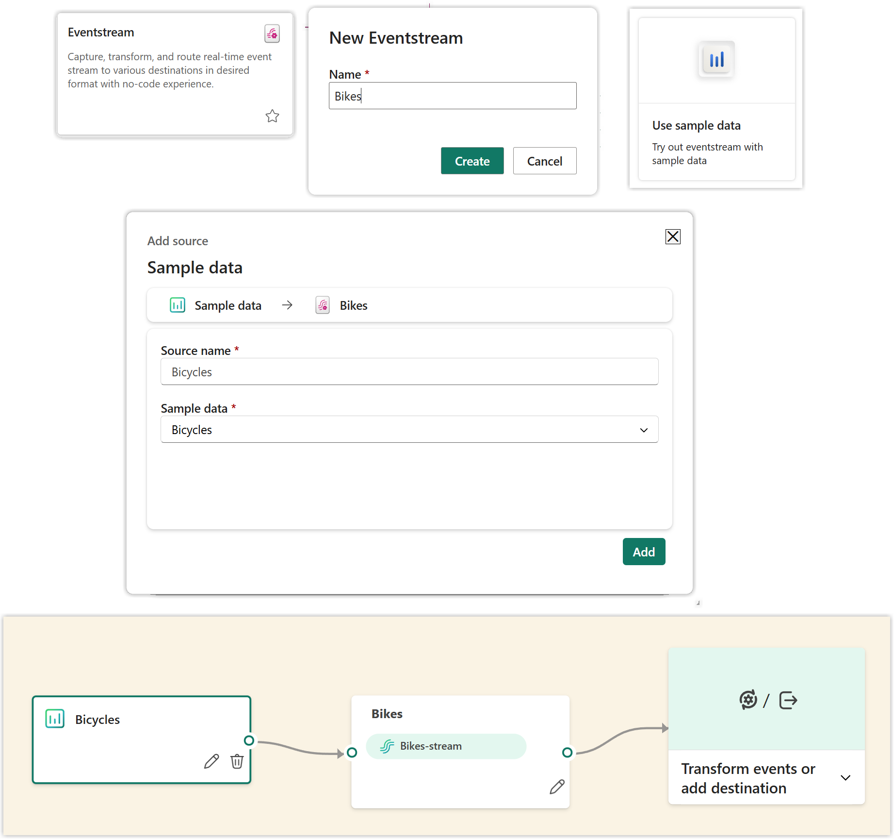
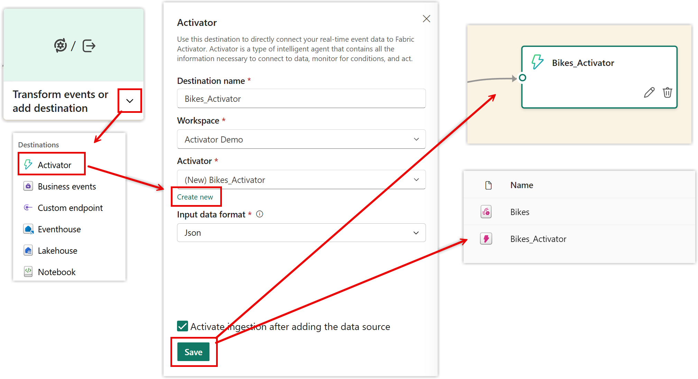

## Scenario

For this post we are going to use the Sample Streaming Data provided by Microsoft of bikes at bike points around London. It contains location data and how many bikes are there and how many empty slots. So I am using an event stream that has a destination of activator. If you already understand how to do that part jump to the Adding Activator Rule section

## Setting up the Eventstream

> [!NOTE]Instructions
> 1. In a Fabric enabled workspace add a new item Eventstream.
> 1. When the New Eventstream dialog appears, type in a name for the eventstream and click Create.
> 1. When it opens, click Use sample data.
> 1. In the add source dialog the default is the bicycles sample data, click Add.

This will create you an eventstream without any transformations or a destination. The next step is to add that destination.

> [!NOTE]Instructions
> 1. Click on the down arrow on the last step in the stream to reveal a list of options
> 1. Click on Activator
> 1. In the Activator pane that appears fill in a name
> 1. Leave the workspace as the current one
> 1. Click on Create new under Activator and type in a name
> 1. Click Save to save the changes.
> 1. Click the Publish button to make the changes live

The final step should new just have a name and a few buttons. When you look in the workspace you will see an activator has been created.

## Adding an Activator Rule

When you open the activator item it will show you the Bikes-stream in the explorer pane and data will be shown in the bottom half of the screen. The next step is to create a rule that will trigger a flow. We are going to go for a very simple example of the number of bikes at a location being over 30.

