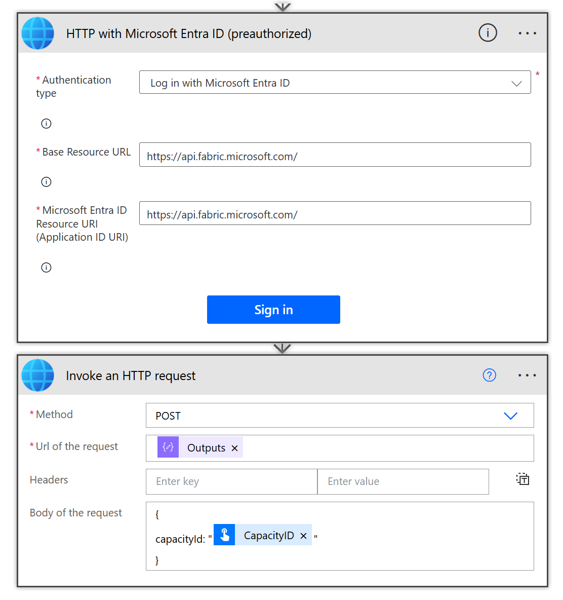

## Introduction

There are times to avoid capacity issues you need to automatically move a workspace from one capacity to another. Situations could include a capacity getting close to capacity, a new capacity becoming available or a scheduled peak activity that requires a standby capacity being used.

## Scenario

I have 2 capacities that are in the same region. There are restrictions on moving regions that are detailed here 
[https://learn.microsoft.com/en-us/fabric/admin/portal-workspace-capacity-reassignment#restrictions-on-moving-workspaces-around](https://learn.microsoft.com/en-us/fabric/admin/portal-workspace-capacity-reassignment#restrictions-on-moving-workspaces-around?wt.mc_id=DX-MVP-5003563)
 I am admin of the workspace and the capacity I am assigning the workspace to, or I could just be Fabric Admin. 

## Create the Flow

This flow is going to be a child flow so that it can run as a once off and be called as part of another process. I wrote a blog post back in 2022 regarding the requirements of a child flow [this can be found here](/power-automate-child-flow/) 

The action we are going to perform is a rest api call to Fabric to assign a capacity. Microsoft have provided documentation.

[Microsoft Learn - Workspaces - Assign a Capacity](https://learn.microsoft.com/en-us/rest/api/fabric/core/workspaces/assign-to-capacity?wt.mc_id=DX-MVP-5003563&tabs=HTTP)

So the information required is the workspace id and the capacity id. We will add those as parameters into the manual trigger.

> [!NOTE]Instructions
> 1. Inside a solution, create an instant flow and enter in a name for the flow
> 1. Select Manually trigger a flow
> 1. Click create to enter into the flow editor
> 1. Expand the trigger and add 2 text inputs, WorkspaceID and CapacityID 
> 1. Add a compose step to construct the url required, see the code block below. Be aware the ['text'] refers to the first text parameter on the trigger. In the editor it will show up as WorkspaceID.
> 1. Rename your compose step and save your flow

```
https://api.fabric.microsoft.com/v1/workspaces/@{triggerBody()['text']}/assignToCapacity
```


## HTTP Call to Microsoft Fabric

We are going to use a HTTP with Microsoft Entra ID that is preauthorised. 

> [!NOTE]Instructions
> 1. Find and add the HTTP with Microsoft Entra ID action
> 1. If this is the first time using this connection it will prompt for connection details, otherwise skip to 6.
> 1. Select Log in with Microsoft Entra ID as the authentication type. 
> 1. For Base Resource URL and Resource URI enter in ```https://api.fabric.microsoft.com/```
> 1. Click Sign and do the stuff to complete the connection and the action appears
> 1. Select POST for the method and the compose output for the Url
> 1. For the body you need to enter in a short JSON statement, see code block below. Text_1 is refering to the second trigger input, it will show as CapacityID once entered.

```
{
capacityId: "@{triggerBody()['text_1']}"
}
```



## Testing the flow

The flow is now ready to be tested. Make sure you have the workspace and capacity ids ready.

> [!NOTE]Instructions
> 1. 
> 1. 
> 1. 
> 1. 
> 1. 


## Child Flow Requirements


## Resources

- [Microsoft Learn - Fabric Rest API Assign to Capacity](https://learn.microsoft.com/en-us/rest/api/fabric/core/workspaces/assign-to-capacity?wt.mc_id=DX-MVP-5003563)
- [Microsoft Learn - Capacity Reassignment Restrictions](https://learn.microsoft.com/en-us/fabric/admin/portal-workspace-capacity-reassignment?wt.mc_id=DX-MVP-5003563)

